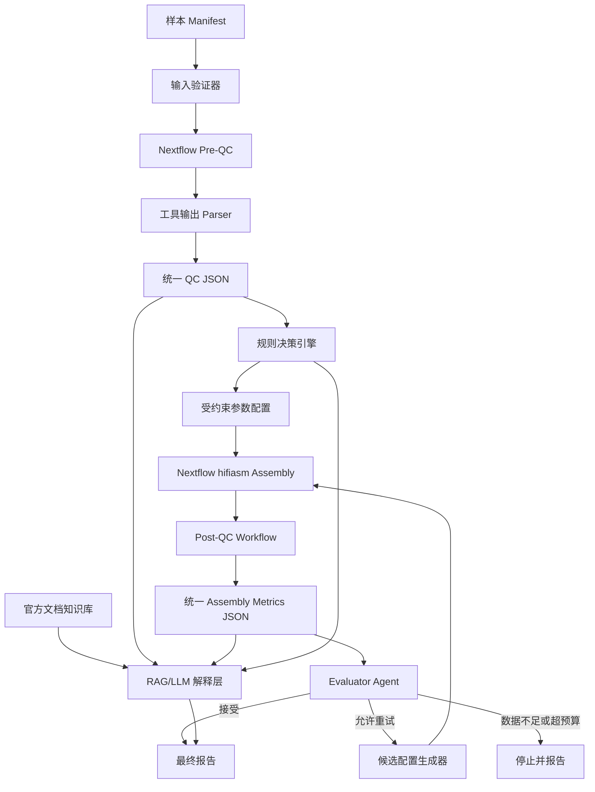
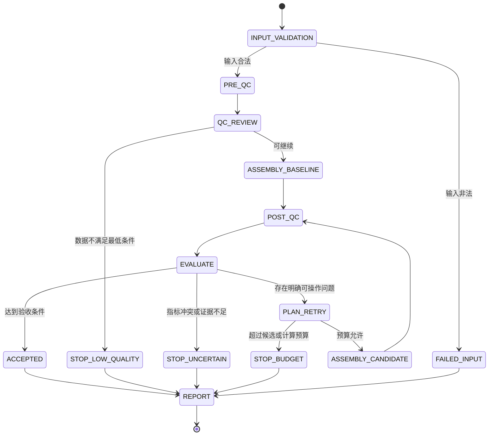

# HiFi Agent V1 项目计划书

> **项目定位**：面向 PacBio HiFi 单样本真核基因组的自动质控、hifiasm 参数决策、组装执行与质量闭环评估系统  
> **文档版本**：V1.0  
> **编制日期**：2026-06-25  
> **目标用途**：个人实习项目、GitHub 开源作品、技术面试演示  
> **建议开发周期**：10～14 周，每周投入 12～20 小时  
> **核心原则**：结构化指标驱动、参数白名单约束、决策可解释、执行可复现、结果可追溯

---

## 1. 项目摘要

HiFi Agent V1 是一个面向 **PacBio HiFi 原始测序数据** 的受约束基因组组装 Agent。系统接收一个样本的 FASTQ/FASTQ.GZ 文件和少量样本元数据，自动执行组装前 QC、k-mer 分析、hifiasm 组装以及组装后质量评估；随后根据结构化指标和专家规则，判断是否接受当前组装、提出有限的 hifiasm 参数候选、重新运行并比较候选结果，最终生成带有证据、风险和运行记录的报告。

V1 不追求“让大语言模型自由操作服务器”，而采用以下混合架构：

```text
确定性 Nextflow 工作流
        +
结构化 JSON 数据模型
        +
专家规则和参数白名单
        +
有限状态 Agent 控制器
        +
可选的 RAG/LLM 解释层
```

系统必须能够在不接入 LLM 的情况下完成基础流程和规则决策；接入 LLM 后，LLM 只负责证据归纳、解释和合法候选排序，不得直接生成并执行任意 Shell 命令。

---

## 2. 项目目标

### 2.1 总体目标

完成一个可以公开展示和重复运行的 V1 系统，证明以下能力：

1. 能够对 PacBio HiFi FASTQ 进行可靠的基础 QC；
2. 能够将不同工具的输出统一解析为稳定的 JSON Schema；
3. 能够运行默认 hifiasm，并规范处理 GFA/FASTA 输出；
4. 能够通过 QUAST、BUSCO、k-mer 和 reads mapping 指标综合评价组装；
5. 能够根据明确规则产生合法、有限、可解释的参数候选；
6. 能够在计算预算限制下完成一次或两次闭环重试；
7. 能够生成完整的参数依据、质量比较和 provenance 报告；
8. 能够在本地服务器上复现运行。

### 2.2 求职展示目标

项目最终应体现以下技术能力：

- 基因组学和基因组组装基础；
- PacBio HiFi 数据分析；
- hifiasm 参数和输出理解；
- Nextflow；
- Python 工程化、数据模型、单元测试；
- Agent 状态机、工具调用、安全约束；
- RAG/LLM 受约束应用；
- 生物信息学 benchmark 与消融实验；
- 可复现性、日志、报告与项目文档。

---

## 3. V1 项目规格

## 3.1 支持范围

| 项目 | V1 规格 |
|---|---|
| 测序数据 | PacBio HiFi FASTQ、FASTQ.GZ；允许一个样本对应多个文件 |
| 样本数 | 单次运行一个样本；批量样本作为后续扩展 |
| 生物类型 | 真核基因组 |
| 倍性 | 重点支持二倍体；允许标记为高度近交/高度纯合 |
| 组装模式 | HiFi-only contig assembly |
| 组装器 | hifiasm |
| 工作流引擎 | Nextflow DSL2 |
| 执行环境 | Linux |
| 交互方式 | CLI 为必需；Streamlit 演示界面为可选增强 |
| 决策方式 | 专家规则为主，RAG/LLM 为可选解释和排序层 |
| 重试次数 | 默认最多 1 次，最大不超过 2 次 |
| 候选数 | 每轮最多 2 个候选参数组合 |
| 报告 | JSON、TSV、Markdown，最终可选生成 HTML |

## 3.2 输入规格

### 必需输入

| 字段 | 类型 | 示例 | 说明 |
|---|---|---|---|
| `sample_id` | string | `A_thaliana_01` | 只允许字母、数字、下划线和短横线 |
| `hifi_reads` | path/list | `/data/sample.fastq.gz` | 一个或多个 HiFi FASTQ 文件 |
| `outdir` | path | `results/A_thaliana_01` | 运行输出目录 |

### 推荐输入

| 字段 | 类型 | 示例 | 用途 |
|---|---|---|---|
| `species_name` | string/null | `Arabidopsis thaliana` | 报告、BUSCO lineage 推荐和污染解释 |
| `expected_genome_size` | integer/null | `820000000` | 覆盖度计算和 assembly size 偏差评估 |
| `ploidy` | integer/null | `2` | 决策边界；V1 主要支持 2 |
| `inbred` | bool/null | `false` | 判断是否允许生成 `-l0` 候选 |
| `busco_lineage` | string/null | `metazoa_odb12` | BUSCO 运行数据集 |
| `kmer_reads` | path/list/null | Illumina PE reads | 可选的独立高准确度 k-mer 数据源 |
| `reference_genome` | path/null | `reference.fa` | 可选参考；用于 QUAST 参考模式，不作为必需条件 |
| `max_threads` | integer | `480` | 当前大型本地服务器的资源上限，预留 32 个逻辑 CPU |
| `max_memory_gb` | integer | `960` | 当前大型本地服务器的资源上限，预留 64 GB |

### 输入限制

- V1 不接收 Hi-C、亲本 trio、ONT ultra-long 作为组装输入；
- V1 不保证正确处理多倍体；`ploidy != 2` 时必须给出范围外警告；
- FASTA 输入只允许用于已组装结果的评估，不作为原始 HiFi QC 输入；
- 输入文件不得由 LLM 自行发现，必须由 manifest 或 CLI 显式指定。

## 3.3 输出规格

每次运行至少生成：

```text
results/<sample_id>/
├── 00_metadata/
│   ├── resolved_config.yaml
│   ├── run_manifest.json
│   ├── software_versions.tsv
│   └── input_checksums.tsv
├── 01_pre_qc/
│   ├── raw_metrics.json
│   ├── seqkit/
│   ├── nanoplot/
│   └── kmer/
├── 02_assembly/
│   ├── baseline/
│   └── candidate_*/
├── 03_post_qc/
│   ├── baseline/
│   └── candidate_*/
├── 04_decisions/
│   ├── decision_trace.jsonl
│   ├── candidate_configs.yaml
│   └── comparison.tsv
├── 05_report/
│   ├── final_report.md
│   ├── final_summary.json
│   └── figures/
└── logs/
```

最终报告至少回答：

1. 输入数据是否符合 HiFi V1 范围；
2. 数据量、长度、质量和 GC 情况；
3. 估计覆盖度及其可信度；
4. hifiasm 使用了哪些参数；
5. 为什么保持默认参数或为什么修改参数；
6. 每个候选组装的主要质量指标；
7. 最终选择了哪个组装；
8. 存在哪些限制和风险；
9. 所有工具版本、命令模板和配置文件位置。

---

## 4. V1 明确不做的内容

以下内容不属于 V1 验收范围：

- Hi-C phased assembly；
- trio binning；
- ultra-long ONT 辅助组装；
- 多倍体自动参数优化；
- 染色体级 scaffolding；
- purge_dups 等第三方组装后去冗余自动化；
- 基因组注释和重复序列注释；
- 自动下载任意物种数据；
- 多用户 Web 平台、账号、权限和任务队列；
- 无限制网格搜索或贝叶斯参数优化；
- 让 LLM 直接执行任意 Bash；
- 以 N50 单一指标自动选择最佳组装。

这些功能可以进入 V2/V3 路线图，但不能阻塞 V1 完成。

---

## 5. 核心工具选择

| 模块 | 首选工具 | V1 用途 | 是否必需 |
|---|---|---|---:|
| 输入检查 | `gzip`, `seqkit` | 格式、压缩文件完整性、基础统计 | 是 |
| 长读长可视化 | NanoPlot | 长度、质量及二者关系图 | 是 |
| k-mer 计数 | meryl | k-mer histogram、覆盖峰、QV/完整性输入 | 是 |
| 基因组特征估计 | GenomeScope 2.0 | 基因组大小、杂合度、重复比例的辅助估计 | 条件性 |
| 组装 | hifiasm | baseline 和候选组装 | 是 |
| GFA 转换 | gfatools | 从 GFA 提取 contig FASTA | 是 |
| 基础组装评估 | QUAST | size、contig、N50、L50 等 | 是 |
| 基因空间完整性 | BUSCO | C/S/D/F/M 指标 | 是 |
| k-mer 评估 | Merqury | QV、completeness、spectrum | 条件性 |
| reads mapping | minimap2 + samtools | 比对率、覆盖分布、异常覆盖 | 是 |
| 覆盖统计 | mosdepth | 全局与窗口覆盖统计 | 是 |
| 报告聚合 | 自定义 Markdown + HTML | 汇总报告 | 是 |

### 5.1 k-mer 数据源分级

系统必须记录 k-mer 数据源：

| 数据源 | 等级 | 解释要求 |
|---|---|---|
| 同一样本独立 Illumina WGS | `independent_high_confidence` | 可用于较强的 Merqury QV/completeness 结论 |
| PacBio HiFi reads 本身 | `same_data_advisory` | 可用于诊断和相对比较，但报告中必须说明非完全独立 |
| 无 k-mer 数据 | `unavailable` | 不得伪造 QV 或 completeness |

---

## 6. 系统架构



### 6.1 架构职责边界

| 层 | 可以做什么 | 不可以做什么 |
|---|---|---|
| Nextflow | 调度经过验证的工具和固定脚本 | 进行开放式生物学推理 |
| Parser | 读取工具输出并转换为 JSON | 根据指标自行修改参数 |
| 规则引擎 | 根据结构化指标触发已定义动作 | 生成白名单之外的参数 |
| Agent 控制器 | 管理状态、预算、候选和停止条件 | 跳过验证直接执行 LLM 文本 |
| RAG/LLM | 解释证据、引用文档、候选排序 | 直接拼接 Shell 并执行 |
| 报告器 | 渲染事实、决策和限制 | 隐藏失败步骤或缺失指标 |

---

## 7. Agent 状态机规格



### 7.1 合法终止状态

```text
ACCEPTED
FAILED_INPUT
STOP_LOW_QUALITY
STOP_INSUFFICIENT_METADATA
STOP_UNCERTAIN
STOP_BUDGET_EXCEEDED
FAILED_TOOL_EXECUTION
```

系统不能只有“成功/失败”两个状态；生物信息学证据不足时应允许安全停止。

---

## 8. 数据模型规格

## 8.1 样本配置 `SampleConfig`

```yaml
sample_id: A_thaliana_01
hifi_reads:
  - /data/A_thaliana.hifi.fastq.gz
outdir: results/A_thaliana_01
species_name: Pteria penguin
expected_genome_size: 820000000
ploidy: 2
inbred: false
busco_lineage: metazoa_odb12
kmer_reads: null
reference_genome: null
resources:
  max_threads: 480
  max_memory_gb: 960
agent:
  max_retry_rounds: 1
  max_candidates_per_round: 2
  objective: balanced
```

## 8.2 组装前指标 `PreQcMetrics`

```json
{
  "sample_id": "A_thaliana_01",
  "input_status": "PASS",
  "read_count": 1532000,
  "total_bases": 21500000000,
  "mean_read_length": 14033,
  "read_n50": 16210,
  "mean_qscore": 31.2,
  "gc_percent": 38.6,
  "estimated_genome_size": 820000000,
  "estimated_coverage": 26.22,
  "kmer_source": "same_data_advisory",
  "warnings": []
}
```

覆盖度计算：

\[
C = \frac{B}{G}
\]

其中：

- \(C\)：估计覆盖度；
- \(B\)：HiFi 总碱基数；
- \(G\)：预期或估计单倍体基因组大小。

如果 \(G\) 不可用，`estimated_coverage` 必须为 `null`，不得猜测。

## 8.3 组装配置 `AssemblyConfig`

```yaml
run_id: baseline
assembler: hifiasm
input_reads: results/A_thaliana_01/01_pre_qc/seqkit/A_thaliana.hifi.fastq.gz
threads: 480
parameters:
  purge_level: 3
  purge_similarity: 0.55
  hom_cov: null
  disable_post_join: false
reason_codes:
  - BASELINE_DEFAULT
source_metrics:
  - pre_qc.estimated_coverage
risk_level: low
requires_user_confirmation: false
```

## 8.4 组装评估 `AssemblyMetrics`

```json
{
  "run_id": "baseline",
  "assembly_size": 846000000,
  "contig_count": 412,
  "contig_n50": 18500000,
  "longest_contig": 62000000,
  "busco_complete": 96.8,
  "busco_single": 92.4,
  "busco_duplicated": 4.4,
  "busco_fragmented": 1.1,
  "busco_missing": 2.1,
  "kmer_qv": 43.5,
  "kmer_completeness": 97.2,
  "mapped_read_fraction": 0.994,
  "coverage_cv": 0.31,
  "assembly_size_ratio": 1.032,
  "tool_failures": [],
  "metric_limitations": []
}
```

## 8.5 决策记录 `DecisionRecord`

```json
{
  "decision_id": "D0004",
  "timestamp": "2026-06-25T10:20:30+09:00",
  "state_before": "EVALUATE",
  "action": "ACCEPT",
  "reason_codes": [
    "ASSEMBLY_SIZE_WITHIN_RANGE",
    "BUSCO_COMPLETE_HIGH",
    "NO_STRONG_DUPLICATION_SIGNAL"
  ],
  "evidence": {
    "assembly_size_ratio": 1.032,
    "busco_complete": 96.8,
    "busco_duplicated": 4.4
  },
  "confidence": 0.86,
  "risk_level": "low",
  "human_readable_explanation": "当前结果没有足够证据支持修改默认 hifiasm 参数。"
}
```

---

## 9. 参数安全规格

## 9.1 V1 允许自动处理的 hifiasm 参数

| 逻辑字段 | hifiasm 参数 | 自动生成条件 | 风险等级 |
|---|---|---|---|
| `threads` | `-t` | 根据资源上限 | 低 |
| `output_prefix` | `-o` | 由系统安全生成 | 低 |
| `purge_level` | `-l` | 仅规则明确时；`-l0` 需 inbred 信息 | 中 |
| `purge_similarity` | `-s` | 仅对疑似 purge 不足生成有限候选 | 中高 |
| `hom_cov` | `--hom-cov` | hifiasm 推断与可信覆盖峰明显冲突 | 中高 |
| `disable_post_join` | `-u` | 有结构错误证据或保守模式 | 中 |

V1 不允许 LLM 自动引入其他参数。新增参数必须经过：

1. 官方文档核验；
2. Schema 定义；
3. 范围校验；
4. 单元测试；
5. 规则和风险说明；
6. 版本兼容测试。

## 9.2 命令生成原则

正确：

```python
validated = AssemblyConfig.model_validate(candidate_dict)
command = hifiasm_command_builder(validated)
```

禁止：

```python
command = llm_response
subprocess.run(command, shell=True)
```

所有命令应以参数数组或 Nextflow `script` 模板生成；路径必须经过转义和白名单校验。

---

## 10. 建议目录结构

```text
hifi-agent/
├── README.md
├── LICENSE
├── CHANGELOG.md
├── CONTRIBUTING.md
├── pyproject.toml
├── environment.yml
├── .gitignore
├── .pre-commit-config.yaml
├── configs/
│   ├── default.yaml
│   ├── tools.yaml
│   ├── thresholds.yaml
│   └── profiles/
│       └── local.yaml
├── workflow/
│   ├── main.nf
│   ├── nextflow.config
│   ├── conf/
│   │   ├── base.config
│   │   └── local.config
│   ├── modules/
│   │   ├── input_check.nf
│   │   ├── seqkit_stats.nf
│   │   ├── nanoplot.nf
│   │   ├── kmer_count.nf
│   │   ├── genomescope.nf
│   │   ├── hifiasm.nf
│   │   ├── gfa_to_fasta.nf
│   │   ├── quast.nf
│   │   ├── busco.nf
│   │   ├── merqury.nf
│   │   └── read_mapping.nf
│   └── subworkflows/
│       ├── pre_qc.nf
│       ├── assembly.nf
│       └── post_qc.nf
├── src/hifi_agent/
│   ├── __init__.py
│   ├── cli.py
│   ├── constants.py
│   ├── exceptions.py
│   ├── schemas/
│   │   ├── sample.py
│   │   ├── qc.py
│   │   ├── assembly.py
│   │   └── decision.py
│   ├── parsers/
│   │   ├── seqkit.py
│   │   ├── nanoplot.py
│   │   ├── genomescope.py
│   │   ├── hifiasm_log.py
│   │   ├── quast.py
│   │   ├── busco.py
│   │   ├── merqury.py
│   │   └── mapping.py
│   ├── rules/
│   │   ├── pre_qc.py
│   │   ├── assembly_review.py
│   │   └── registry.py
│   ├── agent/
│   │   ├── state.py
│   │   ├── controller.py
│   │   ├── planner.py
│   │   ├── evaluator.py
│   │   ├── budget.py
│   │   └── safety.py
│   ├── executors/
│   │   ├── nextflow.py
│   │   └── command_builder.py
│   ├── reporting/
│   │   ├── markdown.py
│   │   ├── tables.py
│   │   └── templates/
│   └── rag/
│       ├── indexer.py
│       ├── retriever.py
│       └── sources.yaml
├── rules/
│   ├── pre_qc_rules.yaml
│   ├── hifiasm_rules.yaml
│   └── acceptance_rules.yaml
├── docs/
│   ├── architecture.md
│   ├── schemas.md
│   ├── rule_catalog.md
│   ├── user_guide.md
│   ├── developer_guide.md
│   └── decisions/
├── examples/
│   ├── samplesheet.csv
│   ├── sample_config.yaml
│   └── expected_outputs/
├── tests/
│   ├── unit/
│   ├── integration/
│   ├── workflow/
│   ├── fixtures/
│   └── golden/
├── benchmark/
│   ├── datasets.yaml
│   ├── perturbations/
│   ├── run_benchmark.py
│   ├── evaluate.py
│   └── reports/
├── scripts/
│   ├── download_test_data.sh
│   ├── validate_environment.sh
│   └── release_check.sh
└── ui/
    └── app.py
```

### 10.1 目录设计原则

- `workflow/` 只负责流程编排，不包含 Agent 推理；
- `src/hifi_agent/parsers/` 每个工具一个 parser；
- `rules/` 保存可审查的 YAML 规则；
- `tests/fixtures/` 保存小型、可公开的工具输出样例；
- `tests/golden/` 保存固定输入对应的期望 JSON；
- `benchmark/` 与普通单元测试分开；
- `docs/decisions/` 保存 Architecture Decision Record；
- 大型 FASTQ、数据库和组装结果不得提交 Git。

---

# 11. 分阶段实施计划

## 阶段 0：需求冻结与技术基线

**建议时间**：2～3 天  
**目标**：冻结 V1 边界，避免开发过程中无限增加功能。

### 任务

- [ ] 建立 GitHub 仓库；
- [ ] 编写一页式项目说明；
- [ ] 固定 V1 支持范围和非目标；
- [ ] 决定主开发环境：Linux + Nextflow；
- [ ] 记录服务器 CPU、内存和磁盘情况；
- [ ] 选择一个极小测试数据和一个真实 benchmark 数据；
- [ ] 建立 issue 标签：`workflow`、`parser`、`rule`、`agent`、`test`、`docs`；
- [ ] 建立 Git 分支策略：`main` + feature branches；
- [ ] 创建项目看板：Backlog、Doing、Review、Done。

### 交付物

- `README.md` 初版；
- `docs/project_scope.md`；
- `docs/decisions/0001-v1-scope.md`；
- `benchmark/datasets.yaml` 初版。

### 阶段验收

- [ ] 所有人都可以用一句话说明 V1 做什么；
- [ ] Hi-C、trio、ONT、多倍体和注释被明确排除；
- [ ] 已确定至少一个可公开使用的小型测试数据；
- [ ] GitHub issue 中已建立后续阶段任务。

---

## 阶段 1：Python 工程骨架与代码质量

**建议时间**：3～5 天  
**目标**：先建立稳定工程结构，再写生物信息学逻辑。

### 任务

- [ ] 创建 `pyproject.toml`；
- [ ] 使用 `src/` layout；
- [ ] 配置 Python 版本范围；
- [ ] 加入 `pytest`；
- [ ] 加入 `ruff` 或同类 lint/format 工具；
- [ ] 加入类型检查；
- [ ] 配置 pre-commit；
- [ ] 建立 GitHub Actions 基础 CI；
- [ ] 实现 `hifi-agent --help`；
- [ ] 统一日志格式和异常类型；
- [ ] 定义退出码。

### CLI 初版

```text
hifi-agent validate CONFIG
hifi-agent plan CONFIG
hifi-agent run CONFIG
hifi-agent evaluate RUN_DIR
hifi-agent report RUN_DIR
```

### 阶段验收

- [ ] 新环境执行安装命令后可运行 `hifi-agent --help`；
- [ ] `pytest` 可运行；
- [ ] CI 在 push 时自动执行 lint 和 unit tests；
- [ ] 代码中不存在散落的 `print()` 调试信息；
- [ ] 所有公共函数有类型注解和简明 docstring。

---

## 阶段 2：配置 Schema 与输入验证

**建议时间**：4～6 天  
**目标**：让所有输入在执行前变成经过验证的结构化配置。

### 任务

- [ ] 使用 Pydantic 定义 `SampleConfig`；
- [ ] 校验 `sample_id`；
- [ ] 校验 FASTQ 路径是否存在；
- [ ] 检查 gzip 完整性；
- [ ] 检查 FASTQ 是否至少包含一条完整记录；
- [ ] 阻止输出目录覆盖关键输入；
- [ ] 校验线程、内存和重试预算；
- [ ] 允许未知元数据使用 `null`；
- [ ] 生成 `resolved_config.yaml`；
- [ ] 生成输入文件 SHA-256；
- [ ] 编写合法和非法配置测试。

### 必须覆盖的失败用例

- [ ] FASTQ 文件不存在；
- [ ] gzip 文件损坏；
- [ ] `sample_id` 含空格或 `/`；
- [ ] `ploidy` 为 0；
- [ ] 线程数为负数；
- [ ] 输出目录位于输入文件内部并可能覆盖输入；
- [ ] V1 收到 Hi-C 或 ONT 配置字段时明确拒绝或警告。

### 阶段验收

- [ ] 所有工作流运行前必须通过配置验证；
- [ ] 无法验证的输入不会启动耗时任务；
- [ ] 配置错误信息明确指出字段、当前值和合法范围；
- [ ] 测试覆盖至少 10 个边界用例。

---

## 阶段 3：Nextflow 最小工作流与执行 Profile

**建议时间**：5～7 天  
**目标**：完成一个能够在 local 上执行、失败后恢复的最小 DSL2 工作流。

### 任务

- [ ] 创建 `main.nf` 和 `nextflow.config`；
- [ ] 创建 local profile；
- [ ] 实现一个示例 process；
- [ ] 配置 `workDir`、publishDir 和日志目录；
- [ ] 开启 timeline、report、trace 和 DAG 输出；
- [ ] 验证 `-resume`；
- [ ] 为 process 配置 CPU、memory 和 time；
- [ ] 验证任务失败时日志能定位具体 process。

### 阶段验收

- [ ] 同一工作流可在 local profile 启动；
- [ ] 人为中断后使用 `-resume` 不重复成功任务；
- [ ] 输出中包含 trace、timeline、report 和 DAG；
- [ ] 运行配置与代码逻辑分离；
- [ ] 一个进程失败不会删除已有正确输出。

Nextflow 提供缓存与 `-resume` 机制，也支持将执行逻辑与配置分离，这一阶段必须优先验证。[1]

---

## 阶段 4：基础组装前 QC

**建议时间**：5～7 天  
**目标**：完成不涉及主观阈值的原始 HiFi 基础统计。

### 任务

- [ ] 实现 `SEQKIT_STATS` module；
- [ ] 实现 `NANOPLOT` module；
- [ ] 统一处理多个 FASTQ 输入；
- [ ] 记录 reads 数和总碱基量；
- [ ] 获取 mean length、N50、GC 和质量信息；
- [ ] 编写 SeqKit parser；
- [ ] 编写 NanoPlot/NanoStats parser；
- [ ] 输出 `raw_metrics.json`；
- [ ] 对 parser 编写 golden tests；
- [ ] 处理工具输出缺字段和版本差异。

### 阶段验收

- [ ] 给定固定测试 FASTQ，输出 JSON 字段稳定；
- [ ] parser 不依赖 HTML 页面视觉解析；
- [ ] 数值字段类型正确；
- [ ] 缺失质量值时返回 `null` 和 warning，而不是 0；
- [ ] 多文件统计与合并后统计一致或有明确解释。

NanoPlot 会生成长读长长度和质量相关图，并输出 NanoStats 汇总文件，可用于稳定解析。[2]

## 阶段 5：k-mer 分析与覆盖度估计

**建议时间**：7～10 天  
**目标**：建立 k-mer 数据库、覆盖峰和基因组属性的结构化输出，同时明确数据源可信度。

### 任务

- [ ] 安装 meryl；
- [ ] 固定默认 k 值及其配置入口；
- [ ] 实现 k-mer count module；
- [ ] 输出 histogram；
- [ ] 条件性运行 GenomeScope 2.0；
- [ ] 解析 genome size、heterozygosity、repeat fraction 和模型拟合状态；
- [ ] 记录 `kmer_source`；
- [ ] 使用预期基因组大小或估计大小计算 coverage；
- [ ] 处理 GenomeScope 拟合失败；
- [ ] 对低覆盖、异常多峰和无明显峰给出 warning；
- [ ] 建立人工 histogram parser 测试；
- [ ] 不把异常拟合结果作为强制参数依据。

### 阶段验收

- [ ] `expected_genome_size` 已知时 coverage 计算正确；
- [ ] genome size 不可用时 coverage 为 `null`；
- [ ] GenomeScope 拟合失败不会导致系统编造结果；
- [ ] 结果中明确标记独立 Illumina 或同源 HiFi 数据；
- [ ] 对同一 histogram，parser 结果可重复。

GenomeScope 2.0 使用 k-mer 频率分布估计基因组大小、杂合度和重复比例；Merqury 则可提供基于 k-mer 的质量与准确性评估能力。[3][4]

---

## 阶段 6：hifiasm baseline 组装

**建议时间**：5～8 天  
**目标**：只使用经过验证的配置运行默认 hifiasm，并规范保存所有关键输出。

### 任务

- [ ] 安装 hifiasm；
- [ ] 实现 baseline assembly module；
- [ ] 默认只设置输出前缀和线程；
- [ ] 保存标准输出和标准错误；
- [ ] 保存所有 GFA 和 `.bin` 中间文件；
- [ ] 提取 primary contig FASTA；
- [ ] 提取两个 partially phased haplotype FASTA；
- [ ] 验证 FASTA 非空；
- [ ] 编写 hifiasm log parser；
- [ ] 解析 homozygous coverage threshold 等关键日志；
- [ ] 记录命令、版本、运行时间和峰值资源；
- [ ] 测试重复运行是否复用 `.bin` 文件。

### baseline 原则

第一次组装不得为了体现 Agent 而随意改参数。除线程和输出前缀外，应优先采用 hifiasm 默认配置。

### 阶段验收

- [ ] 能从测试 HiFi 数据产生 GFA；
- [ ] 能稳定提取 primary contig FASTA；
- [ ] 日志 parser 能找到关键覆盖阈值或返回明确缺失；
- [ ] 所有中间文件位置固定；
- [ ] 使用相同 prefix 和兼容参数时可复用 hifiasm 中间结果。

hifiasm 的首次运行会保存 corrected reads 和 overlaps 的 `.bin` 文件，后续兼容运行可以复用，以避免重复执行耗时的 all-vs-all overlap。[6]

---

## 阶段 7：组装后多维 QC

**建议时间**：10～14 天  
**目标**：建立不能被 N50 单独替代的多维评价体系。

### 8.1 QUAST

- [ ] 运行 reference-free QUAST；
- [ ] 大型基因组支持 `--large`；
- [ ] 有参考时增加 reference-based 模式；
- [ ] 解析 assembly size、contig count、N50、L50、largest contig；
- [ ] 解析可用的 misassembly 指标；
- [ ] 保留 HTML 和 TSV 原始报告。

### 8.2 BUSCO

- [ ] 使用显式 lineage；
- [ ] lineage 缺失时允许自动推荐，但必须记录；
- [ ] 解析 C/S/D/F/M；
- [ ] 保留 full table 和 summary；
- [ ] 下载数据集时记录版本；
- [ ] 数据库不可用时返回条件性失败，而不是将完整性记为 0。

### 8.3 k-mer 评价

- [ ] 独立短读长存在时运行 Merqury；
- [ ] 只有 HiFi 时运行受限的 k-mer 诊断并标注 limitation；
- [ ] 解析 QV、completeness 和 spectrum 关键数据；
- [ ] 保留 plots；
- [ ] 避免把非独立数据评估描述为独立验证。

### 8.4 reads mapping

- [ ] 使用 minimap2 将过滤后 HiFi reads 比对回组装；
- [ ] 使用 samtools 排序和索引；
- [ ] 统计 mapped fraction；
- [ ] 计算覆盖均值、中位数、变异系数；
- [ ] 标记极低覆盖和极高覆盖窗口比例；
- [ ] 记录 mapping preset 和工具版本。

### 阶段验收

- [ ] 任一评估工具失败时，其他指标仍可保留；
- [ ] `AssemblyMetrics` 中缺失指标为 `null`；
- [ ] BUSCO 完整性和 duplicated 分开呈现；
- [ ] QUAST、BUSCO、k-mer 与 mapping 结果均有 parser 测试；
- [ ] 最终 JSON 能区分事实、派生指标和限制。

QUAST 用于计算多种组装指标；BUSCO 通过谱系保守直系同源基因评价完整性；Merqury 通过 reads k-mer 与 assembly k-mer 比较评估 QV 和完整性。[6][7][8]

---

## 阶段 8：规则引擎 V0

**建议时间**：7～10 天  
**目标**：不用 LLM，先实现可测试、可审查的专家规则。

### 9.1 规则结构

```yaml
- rule_id: ASM_SIZE_TOO_LARGE_AND_DUPLICATED
  priority: 80
  when:
    all:
      - metric: assembly_size_ratio
        op: ">"
        value: 1.25
      - metric: busco_duplicated
        op: ">"
        value: 10.0
  action: PROPOSE_STRONGER_PURGE
  risk_level: medium_high
  max_candidates: 1
  evidence_required:
    - assembly_size_ratio
    - busco_duplicated
  message: >-
    组装大小和 BUSCO duplicated 同时偏高，存在未充分清除 haplotig 的可能。
```

### 9.2 第一批规则

至少实现：

- [ ] 输入不是 HiFi：停止；
- [ ] 倍性明确不是 2：范围外警告或停止自动调参；
- [ ] genome size 不明：降低覆盖度判断置信度；
- [ ] coverage 明显不足：停止自动参数搜索；
- [ ] inbred 为 true：允许生成 `-l0` 候选；
- [ ] assembly size 明显偏大且 duplication 偏高：候选更严格 purge；
- [ ] assembly size 偏大但 BUSCO duplicated 不高：先提示 genome size 可能不准；
- [ ] hifiasm hom-cov 与可信 k-mer peak 冲突：允许 `--hom-cov` 候选；
- [ ] N50 高但有结构错误证据：允许 `-u` 候选；
- [ ] 指标总体正常：接受默认参数；
- [ ] 多指标冲突：停止并要求人工审查。

### 9.3 阈值策略

- 阈值保存在 `configs/thresholds.yaml`；
- 阈值必须有来源、版本和说明；
- 区分 warning 阈值和 action 阈值；
- 不确定阈值先采用宽松、保守规则；
- 规则必须使用 `reason_code`，不能只有自然语言。

### 阶段验收

- [ ] 至少 10 条规则；
- [ ] 每条规则至少 2 个正向和 2 个反向测试；
- [ ] 对同一输入规则结果确定性一致；
- [ ] 不调用 LLM 也能输出 baseline/stop/retry 决策；
- [ ] 规则冲突有优先级和冲突解决策略；
- [ ] 任何候选参数均来自白名单。

hifiasm 官方参数文档指出，`-l` 控制 purge duplication 级别，`-s` 控制重复 haplotig 的相似度阈值，`--hom-cov` 可用于覆盖阈值推断不正确的情况；这些参数修改均存在过度清除或重复塌缩风险，必须有限使用。[9][10]

---

## 阶段 9：Agent 控制器与预算管理

**建议时间**：7～10 天  
**目标**：将前面模块组合为显式状态机，而不是一个不可控的大 Prompt。

### 任务

- [ ] 定义 `AgentState`；
- [ ] 实现状态转移；
- [ ] 实现 `Planner`；
- [ ] 实现 `Evaluator`；
- [ ] 实现候选去重；
- [ ] 实现重试轮数上限；
- [ ] 实现候选数上限；
- [ ] 实现 CPU-hour 或 walltime 预算字段；
- [ ] 实现失败重试与参数优化重试的区分；
- [ ] 实现 `decision_trace.jsonl`；
- [ ] 实现中断后状态恢复；
- [ ] 对非法状态转移抛出明确异常。

### Agent 工具接口

```python
validate_input(config) -> ValidationResult
run_pre_qc(config) -> PreQcMetrics
plan_baseline(metrics) -> AssemblyConfig
run_assembly(config) -> AssemblyArtifact
run_post_qc(artifact) -> AssemblyMetrics
evaluate(metrics, history) -> Decision
propose_candidates(decision) -> list[AssemblyConfig]
render_report(run_state) -> Path
```

### 阶段验收

- [ ] 每次状态变化写入日志；
- [ ] 达到预算后不会继续启动组装；
- [ ] 相同参数候选不会重复运行；
- [ ] workflow 工具失败不会被误判为生物学质量差；
- [ ] Agent 能在无 LLM 条件下完整执行；
- [ ] 中断后可以从状态文件恢复。

---

## 阶段 10：RAG 与 LLM 受约束解释层

**建议时间**：5～8 天  
**目标**：增加 Agent 项目属性，但不破坏确定性和安全边界。

### 知识库范围

只收录：

- hifiasm 官方参数文档；
- hifiasm FAQ 和输出解释；
- BUS CO 官方用户指南；
- QUAST 官方手册；
- Merqury 官方仓库和论文；
- GenomeScope 2.0 官方仓库和论文；
- 当前项目规则说明。

### 任务

- [ ] 保存知识文档 URL、抓取日期和工具版本；
- [ ] 按参数和问题类型切片；
- [ ] 建立本地向量或全文检索索引；
- [ ] 定义结构化 LLM 输出 Schema；
- [ ] LLM 只能从合法 `action enum` 中选择；
- [ ] LLM 不得增加参数；
- [ ] 将检索证据 ID 写入 decision trace；
- [ ] 无证据时强制输出“不足以判断”；
- [ ] 比较 rules-only 与 rules+RAG 的输出；
- [ ] 准备故意诱导编造参数的安全测试。

### LLM 输出示例

```json
{
  "recommended_action": "KEEP_BASELINE",
  "supporting_rule_ids": ["ASSEMBLY_WITHIN_EXPECTED_RANGE"],
  "source_ids": ["hifiasm_faq_assembly_size_001"],
  "explanation": "当前指标没有提供足够证据支持调整 purge 参数。",
  "uncertainties": ["k-mer QV 使用同一 HiFi 数据，独立性有限"],
  "confidence": 0.78
}
```

### 阶段验收

- [ ] LLM 输出必须通过 Schema 校验；
- [ ] 编造参数会被拒绝；
- [ ] LLM 不可绕过规则和预算；
- [ ] 关闭 LLM 后项目仍可运行；
- [ ] 报告区分“规则事实”和“LLM 解释”；
- [ ] 每个参数解释至少关联一条可追溯来源。

---

## 阶段 11：有限闭环优化

**建议时间**：7～10 天  
**目标**：在明确异常场景下完成一次安全重试和候选比较。

### 任务

- [ ] 定义 baseline 与 candidate 命名；
- [ ] 实现 candidate 配置生成；
- [ ] 实现参数差异报告；
- [ ] 重用 hifiasm `.bin` 文件；
- [ ] 对候选执行同一套 post-QC；
- [ ] 建立 comparison table；
- [ ] 实现被支配候选判定；
- [ ] 定义 acceptance、retry 和 stop 条件；
- [ ] 限制最多 2 个候选；
- [ ] 默认只允许 1 轮优化；
- [ ] 指标冲突时停止自动决策；
- [ ] 保留所有候选，不自动删除失败结果。

### 候选比较最小指标集

| 指标 | 方向 | 备注 |
|---|---|---|
| assembly size ratio | 接近 1 较好 | 依赖 genome size 可信度 |
| BUSCO complete | 高较好 | 只代表基因空间 |
| BUSCO duplicated | 需结合倍性和 size | 不是越低越绝对好 |
| k-mer completeness | 高较好 | 依赖 k-mer 数据源 |
| k-mer QV | 高较好 | 依赖评估条件 |
| mapped read fraction | 高较好 | 不能单独证明正确性 |
| coverage anomaly | 低较好 | 用于发现塌缩/重复候选 |
| N50 | 高通常较好 | 不能压倒正确性指标 |
| misassembly | 低较好 | 仅在可评估时使用 |

### 阶段验收

- [ ] Agent 能对一个人工异常场景生成合法候选；
- [ ] baseline 和 candidate 使用相同评估流程；
- [ ] 不会因为 N50 提升而忽略明显质量退化；
- [ ] 达到重试上限后安全停止；
- [ ] comparison.tsv 能清晰显示参数和指标差异；
- [ ] 最终报告说明选择代价。

---

## 阶段 12：报告系统

**建议时间**：4～7 天  
**目标**：将所有运行事实、决策和限制转化为可面试展示的报告。

### 报告章节

1. 运行摘要；
2. 样本和输入信息；
3. 软件版本和执行环境；
4. 组装前 QC；
5. 数据过滤；
6. baseline hifiasm 配置；
7. baseline 质量；
8. Agent 触发规则；
9. 候选参数和风险；
10. 候选质量对比；
11. 最终选择；
12. 结论限制；
13. 完整 provenance；
14. 错误与未运行模块。

### 任务

- [ ] 使用 Jinja2 模板；
- [ ] 输出 Markdown；
- [ ] 生成 summary JSON；
- [ ] 复制关键图到统一 figures 目录；
- [ ] 生成指标比较表；
- [ ] 生成参数 diff；
- [ ] 加入 warning 和 limitation 区域；
- [ ] 隐藏绝对敏感路径的可选模式；
- [ ] 添加可复现运行命令；
- [ ] 确保失败运行也能生成报告。

### 阶段验收

- [ ] 不阅读日志也能从报告理解整个分析；
- [ ] 所有数值能回溯到原始工具文件；
- [ ] 缺失指标不显示为 0；
- [ ] 参数修改有“原因、证据、风险、结果”；
- [ ] 报告明确标注成功、警告和失败模块。

---

## 阶段 13：测试、Benchmark 与消融

**建议时间**：10～14 天  
**目标**：证明项目不仅能运行，而且决策是可靠、稳定和有边界的。

### 14.1 单元测试

- [ ] Schema；
- [ ] 每个 parser；
- [ ] 阈值计算；
- [ ] coverage 公式；
- [ ] 规则触发；
- [ ] 冲突解决；
- [ ] 命令构造；
- [ ] 路径安全；
- [ ] budget；
- [ ] 状态转移。

### 14.2 集成测试

- [ ] 小 FASTQ → pre-QC；
- [ ] pre-QC fixture → rule engine；
- [ ] 小型 GFA → FASTA；
- [ ] assembly fixture → post-QC parser；
- [ ] baseline metrics → candidate → comparison；
- [ ] workflow 失败 → FAILED_TOOL_EXECUTION。

### 14.3 Benchmark 设计

至少包含：

| 场景 | 构造方式 | 期望行为 |
|---|---|---|
| 正常 HiFi 数据 | 公开真实数据 | 保持默认或接受 baseline |
| 低覆盖 | downsample | 警告数据不足，不盲目搜索 |
| assembly size 偏大 | 使用预制指标 fixture | 触发审查 purge 候选 |
| hom-cov 冲突 | 模拟日志和 k-mer peak | 生成受约束 `--hom-cov` 候选 |
| 近交样本 | 元数据 `inbred=true` | 允许但不强制 `-l0` 候选 |
| 指标冲突 | 高 N50 + 高 misassembly | 停止或选择保守方案 |
| 工具失败 | 损坏输出/非零退出 | 区分工程失败与生物学失败 |

### 14.4 对比方法

- Baseline A：默认 hifiasm；
- Baseline B：固定 pipeline，无 Agent；
- Method C：rules-only；
- Method D：rules + RAG/LLM；
- 可选 Oracle：小范围人工选择。

### 14.5 Agent 指标

- 参数合法率；
- 不存在参数生成率；
- 规则命中准确率；
- 错误重试率；
- 不必要重试率；
- 正确停止率；
- 证据引用正确率；
- 重复运行一致性；
- 平均候选数；
- 额外计算成本。

### 阶段验收

- [ ] parser/rule/safety 核心模块测试覆盖率达到 80% 左右；
- [ ] 所有预设场景有自动化测试；
- [ ] 不存在 hifiasm 参数生成率为 0；
- [ ] 无证据场景不会强行调参；
- [ ] benchmark 报告包含成功案例和失败案例；
- [ ] rules-only 与 rules+LLM 有明确对比。

---

## 阶段 14：文档、演示与 V1 发布

**建议时间**：5～8 天  
**目标**：将工程转化为面试官能够在短时间内理解的作品。

### 任务

- [ ] 完善 README；
- [ ] 绘制架构图；
- [ ] 编写 10 分钟快速开始；
- [ ] 编写完整用户指南；
- [ ] 编写开发者指南；
- [ ] 编写规则目录；
- [ ] 添加示例配置；
- [ ] 准备小型可运行 demo；
- [ ] 准备真实数据报告截图；
- [ ] 录制 3～5 分钟演示视频；
- [ ] 添加 CITATION.cff；
- [ ] 创建 GitHub Release `v1.0.0`；
- [ ] 生成 release checklist；
- [ ] 整理简历项目描述和面试问答。

### 阶段验收

- [ ] 新用户只看 README 能完成小型示例；
- [ ] 仓库不包含大型测序数据和数据库；
- [ ] 所有示例命令可执行；
- [ ] V1 Release 包含版本、变更和已知限制；
- [ ] 演示能说明 Agent 为什么保持或修改参数；
- [ ] 项目具有一份公开 benchmark 结果。

---

# 12. 建议时间表

| 周次 | 主要阶段 | 里程碑 |
|---:|---|---|
| 第 1 周 | 阶段 0～2 | 需求冻结、Python 骨架、配置验证 |
| 第 2 周 | 阶段 3 | Nextflow local 最小流程 |
| 第 3 周 | 阶段 4 | 基础 QC |
| 第 4 周 | 阶段 5 | k-mer 和 coverage |
| 第 5 周 | 阶段 6 | hifiasm baseline |
| 第 6～7 周 | 阶段 7 | QUAST、BUSCO、k-mer、mapping |
| 第 8 周 | 阶段 8 | 规则引擎 V0 |
| 第 9 周 | 阶段 9 | Agent 状态机和预算 |
| 第 10 周 | 阶段 10 | RAG/LLM 解释层 |
| 第 11 周 | 阶段 11～12 | 闭环优化和报告 |
| 第 12～13 周 | 阶段 13 | 测试、benchmark、消融 |
| 第 14 周 | 阶段 14 | 文档、演示、V1 Release |

如果每周投入时间较少，可以将计划扩展到 16～20 周；不应通过跳过测试和 parser 规范来压缩时间。

---

# 13. 每周迭代规则

每个迭代周期都应遵循：

```text
选择一个小目标
→ 写输入/输出规格
→ 先准备 fixture
→ 实现功能
→ 编写单元测试
→ 在 Nextflow 中集成
→ 运行小型端到端测试
→ 更新文档
→ 合并到 main
```

每周结束回答以下问题：

- [ ] 本周新增了什么可运行能力？
- [ ] 是否新增测试？
- [ ] 是否引入新的隐式假设？
- [ ] 是否新增工具版本依赖？
- [ ] 是否更新 Schema？
- [ ] 是否破坏旧输出兼容性？
- [ ] 是否有无法解释的 Agent 决策？
- [ ] 下周最小可交付目标是什么？

---

# 14. 功能需求

| 编号 | 需求 | 优先级 |
|---|---|---:|
| FR-001 | 读取并验证单样本配置 | P0 |
| FR-002 | 对多个 HiFi FASTQ 文件进行统一统计 | P0 |
| FR-003 | 生成 k-mer histogram 和数据源等级 | P0 |
| FR-004 | 运行 hifiasm baseline | P0 |
| FR-005 | 将 GFA 转换为 primary/hap FASTA | P0 |
| FR-006 | 运行 QUAST、BUSCO 和 reads mapping | P0 |
| FR-007 | 条件性运行 k-mer assembly evaluation | P0 |
| FR-008 | 将所有工具输出标准化为 JSON | P0 |
| FR-009 | 根据规则输出 ACCEPT/RETRY/STOP | P0 |
| FR-010 | 生成有限的合法 hifiasm 候选配置 | P0 |
| FR-011 | 比较 baseline 与候选 | P0 |
| FR-012 | 生成最终 Markdown 报告 | P0 |
| FR-013 | 支持 Nextflow `-resume` | P0 |
| FR-014 | 支持 RAG/LLM 解释 | P1 |
| FR-015 | 生成简单 Streamlit 展示界面 | P2 |

---

# 15. 非功能需求

| 编号 | 需求 | 验收方式 |
|---|---|---|
| NFR-001 | 可复现性 | 固定工具版本、配置和 checksum |
| NFR-002 | 安全性 | 参数白名单；禁止直接执行 LLM Shell |
| NFR-003 | 可恢复性 | Nextflow `-resume` 和 Agent 状态文件 |
| NFR-004 | 可测试性 | parser、rules、state 有自动测试 |
| NFR-005 | 可解释性 | 每次决策有 reason code 和 evidence |
| NFR-006 | 可追溯性 | 工具输出、版本、配置、决策完整保存 |
| NFR-007 | 可移植性 | local 环境 |
| NFR-008 | 失败透明 | 不隐藏失败，不将缺失值写成 0 |
| NFR-009 | 预算可控 | 重试轮数和候选数有硬上限 |
| NFR-010 | 向后兼容 | Schema 变更需要版本号和迁移说明 |

---

# 16. 风险登记表

| 风险 | 概率 | 影响 | 应对策略 |
|---|---:|---:|---|
| 工具安装复杂 | 中 | 高 | 优先 conda/环境管理；每个工具独立测试 |
| 大型基因组计算时间过长 | 高 | 高 | 小数据开发；候选上限；复用 `.bin` |
| GenomeScope 对当前数据拟合不稳定 | 中 | 中 | 将其设为条件性指标；保留拟合状态 |
| BUSCO 数据库下载和版本不一致 | 中 | 中 | 固定 lineage 数据集版本并缓存 |
| Merqury 缺少独立短读长 | 高 | 中 | 标记同源 HiFi 数据的非独立限制 |
| hifiasm 参数规则过拟合 | 中 | 高 | 保守阈值；benchmark 多场景；允许 STOP |
| LLM 编造参数 | 中 | 高 | Action Enum、Schema、参数白名单、拒绝机制 |
| LLM 输出不稳定 | 中 | 中 | 规则优先；低 temperature；保存模型版本 |
| parser 因工具版本变化失效 | 中 | 高 | golden tests；版本锁定；容错解析 |
| 项目范围持续膨胀 | 高 | 高 | V1 非目标清单；新增功能进入 V2 backlog |
| 只展示界面而缺乏科学验证 | 中 | 高 | benchmark 和消融作为发布硬条件 |
| 组装质量无法定义唯一最优 | 高 | 中 | 多目标比较；输出 trade-off，不强行单分数 |

---

# 17. 最终验收标准

## 17.1 P0 功能验收

必须全部通过：

- [ ] 从一个合法的 PacBio HiFi FASTQ 配置启动；
- [ ] 完成输入验证和 checksum；
- [ ] 完成 SeqKit 和 NanoPlot QC；
- [ ] 完成 k-mer 统计或明确记录不可用；
- [ ] 完成 hifiasm baseline；
- [ ] 提取 primary contig FASTA；
- [ ] 完成 QUAST；
- [ ] 完成 BUSCO；
- [ ] 完成 reads mapping 和覆盖统计；
- [ ] 条件允许时完成 Merqury 评价；
- [ ] 输出统一 `PreQcMetrics` 和 `AssemblyMetrics`；
- [ ] 输出 ACCEPT、RETRY 或 STOP；
- [ ] 所有候选参数均通过白名单；
- [ ] 最多执行规定次数的候选；
- [ ] 生成 `comparison.tsv`；
- [ ] 生成最终 Markdown 报告；
- [ ] 生成完整 decision trace 和软件版本记录。

## 17.2 科学合理性验收

- [ ] 不使用 N50 作为唯一选择依据；
- [ ] 区分 BUSCO complete 和 duplicated；
- [ ] 区分独立与非独立 k-mer 数据源；
- [ ] genome size 不可信时不强行计算 size 偏差结论；
- [ ] 对低覆盖数据优先报告数据限制，而不是无限调参；
- [ ] 对 inbred 场景只有在元数据支持时才考虑 `-l0`；
- [ ] `--hom-cov` 需要覆盖峰冲突证据；
- [ ] purge 参数修改必须报告丢失真实重复序列的风险；
- [ ] 指标冲突时允许 `STOP_UNCERTAIN`；
- [ ] 最终报告包含限制和不确定性。

## 17.3 工程质量验收

- [ ] local profile 端到端通过；
- [ ] `-resume` 测试通过；
- [ ] 核心 parser/rule/safety 测试覆盖率约 80%；
- [ ] CI 全部通过；
- [ ] 代码 lint 和类型检查通过；
- [ ] 大文件未提交 Git；
- [ ] 依赖版本固定；
- [ ] 新环境可依据 README 完成小型示例；
- [ ] 所有失败均有可定位日志。

## 17.4 Agent 安全验收

- [ ] LLM 关闭时系统仍可运行；
- [ ] LLM 不能直接执行 Bash；
- [ ] LLM 不能添加白名单外参数；
- [ ] 非法参数会被 Schema 拒绝；
- [ ] 每个动作都有 reason code；
- [ ] 每个修改参数都有 evidence；
- [ ] 重试次数存在硬上限；
- [ ] 工具执行失败不会被错误解释为组装质量差；
- [ ] 无证据时输出不足以判断；
- [ ] decision trace 可完整复盘。

## 17.5 求职作品验收

- [ ] GitHub README 有项目图、流程图和快速开始；
- [ ] 至少一个公开 benchmark；
- [ ] 至少一个 Agent 改善异常场景的案例；
- [ ] 至少一个“Agent 正确保持默认参数”的案例；
- [ ] 至少一个“Agent 正确停止”的案例；
- [ ] 有 rules-only 与 rules+LLM 消融对比；
- [ ] 有 3～5 分钟演示视频或 GIF；
- [ ] 有清晰的限制和未来计划；
- [ ] 有 Release `v1.0.0`；
- [ ] 能在面试中解释一次完整决策链。

---

# 18. V1 发布判定

只有满足以下条件才能标记 `v1.0.0`：

```text
P0 功能全部通过
AND
不存在未验证的自动执行参数
AND
至少一个真实数据端到端运行成功
AND
至少六个异常/边界场景自动测试通过
AND
能够生成完整报告和 decision trace
AND
README 可指导新用户完成 demo
AND
已公开已知限制
```

如果未实现 RAG/LLM，但规则 Agent、闭环流程和 benchmark 均完成，可以先发布 `v0.9.0`；加入受约束 RAG/LLM 并通过安全测试后再发布 `v1.0.0`。

---

# 19. 后续版本路线图

| 版本 | 主要扩展 |
|---|---|
| V1.1 | 更丰富规则、参考基因组模式、Streamlit 展示 |
| V1.2 | 多样本批量运行、数据库缓存管理、资源预测 |
| V2.0 | HiFi + Hi-C phased assembly |
| V2.1 | trio binning |
| V2.2 | HiFi + ultra-long ONT |
| V3.0 | 多组装器候选和更正式的多目标优化 |
| V3.1 | 人工反馈学习和规则版本管理 |

---

# 20. 第一周立即执行清单

为避免项目停留在设计阶段，第一周只完成以下内容：

- [ ] 创建 GitHub 仓库；
- [ ] 按本计划建立目录骨架；
- [ ] 创建 `pyproject.toml`；
- [ ] 实现 `SampleConfig`；
- [ ] 实现 `hifi-agent validate`；
- [ ] 创建最小 `main.nf`；
- [ ] 用一个小 FASTQ 运行 `SEQKIT_STATS`；
- [ ] 将 SeqKit 输出解析为 JSON；
- [ ] 为 parser 编写一个 golden test；
- [ ] 在 GitHub Actions 中运行测试；
- [ ] 更新 README，加入当前已完成状态。

第一周完成后，项目应已经具有一条真实、虽小但完整的链路：

```text
配置文件
→ 输入验证
→ Nextflow 调用 SeqKit
→ Parser 生成 JSON
→ pytest 验证结果
```

这条链路将作为后续所有工具模块的模板。

---

# 21. 参考资料

1. Nextflow：Caching and resuming  
   <https://docs.seqera.io/nextflow/cache-and-resume>
2. NanoPlot GitHub repository  
   <https://github.com/wdecoster/nanoplot>
3. GenomeScope 2.0  
   <https://genomescope.org/genomescope2.0/>
4. Merqury GitHub repository  
   <https://github.com/marbl/merqury>
5. hifiasm HiFi-only assembly documentation  
   <https://hifiasm.readthedocs.io/en/latest/pa-assembly.html>
6. QUAST manual  
   <https://quast.sourceforge.net/docs/manual.html>
7. BUSCO user guide  
    <https://busco.ezlab.org/busco_userguide.html>
8. Merqury paper  
    <https://pmc.ncbi.nlm.nih.gov/articles/PMC7488777/>
9. hifiasm parameter reference  
    <https://hifiasm.readthedocs.io/en/latest/parameter-reference.html>
10. hifiasm FAQ  
    <https://hifiasm.readthedocs.io/en/latest/faq.html>
11. Australian BioCommons HiFi de novo genome assembly workflow  
    <https://australianbiocommons.github.io/hifi-assembly-workflow/>

---

## 文档结束

本项目计划书的执行重点不是一次性实现所有模块，而是保证每个阶段都有明确输入、输出、测试和验收标准。开发过程中如需调整范围，应新增 Architecture Decision Record，而不是直接修改核心行为且不留记录。
