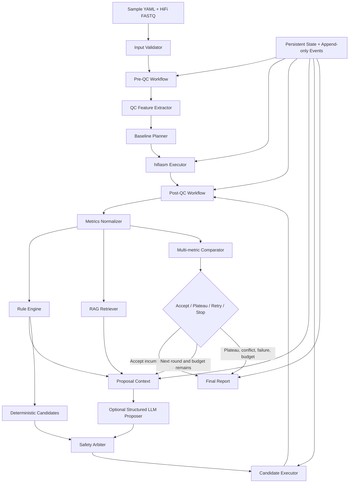

# HiFi Agent V2 项目计划书与任务书

> **项目定位**：面向单样本 PacBio HiFi 真核基因组的自动 QC、RAG/LLM 辅助参数推荐、hifiasm 组装、质量评估和最多三轮受控优化系统  
> **文档版本**：V2.0-draft  
> **编制日期**：2026-07-15  
> **V1 基线版本**：HiFi Agent 1.0.0  
> **目标用途**：指导 V2 开发、测试、真实数据验收和发布  
> **核心原则**：科学证据优先、LLM 提议但不越权、执行参数可证明、迭代有界、失败安全停止、历次结果不可覆盖

---

## 1. 项目背景

HiFi Agent V1 已经实现以下主要能力：

- PacBio HiFi FASTQ/FASTQ.GZ 输入验证和 checksum；
- seqkit、NanoPlot、meryl、GenomeScope 组装前 QC；
- hifiasm baseline 组装；
- QUAST、BUSCO、Merqury 和 reads mapping 组装后评估；
- 基于版本化 YAML 的专家规则和参数白名单；
- 一轮候选规划、真实候选执行、多指标比较和结果报告；
- 本地 RAG 索引和可选 LLM 解释；
- Agent 状态、预算、恢复和审计基础设施。

V1 尚未完整实现最初设想的自动闭环：

1. RAG/LLM 只能解释规则结论，不能提出参数候选；
2. `agent` 与 `optimize` 是分离入口，没有一个命令完成端到端流程；
3. 优化 runner 固定读取 baseline，固定生成第 1 轮候选；
4. `RETRY` 结果没有被上层控制器消费并启动下一轮；
5. 配置最多允许两轮重试，而不是 baseline 后最多三轮优化；
6. 同一 run ID 重跑存在覆盖历史产物的可能；
7. 可选 Nextflow 参数存在空值被解释为布尔 `true` 的缺陷；
8. 真实 Candida 候选原计划仅设置 `disable_post_join=true`，实际命令却额外包含
   `--hom-cov true`，导致该候选不是严格的单变量实验；
9. 当前测试在工作区状态下为 197 passed、1 failed、13 skipped，真实数据和真实 LLM
   验收默认受环境开关保护。

V2 的首要任务不是扩大参数搜索范围，而是先修复执行正确性和审计闭环，再引入受控的
RAG/LLM 参数推荐和三轮优化。

---

## 2. V2 总体目标

V2 必须实现以下端到端流程：

```text
输入验证
  → 原始 HiFi reads QC
  → QC 关键信息抽取与可信度分级
  → baseline 参数决策
  → baseline hifiasm 组装
  → 统一 post-QC 评估
  → 专家规则 + RAG + LLM 生成受控候选
  → 参数安全审批与实际命令验证
  → 候选组装和同源 post-QC
  → 与当前最优组装进行多指标比较
  → 接受新 incumbent / 平台期停止 / 风险停止
  → 最多执行 3 个优化轮次
  → 生成完整历史、最终报告和 provenance
```

V2 完成后，用户应能够通过一个主命令从样本配置运行到终态：

```bash
hifi-agent assemble sample.yaml --resume
```

在需要调用外部 LLM 时，必须显式选择模式并提供密钥：

```bash
hifi-agent assemble sample.yaml --decision-mode hybrid --resume
```

系统不得宣传能够获得数学意义或生物学意义上的“全局最佳参数”。V2 报告中的规范术语为：

> 在当前数据、知识库、白名单参数、计算预算和质量保护条件下，证据支持度最高的候选参数。

---

## 3. 成功标准

### 3.1 功能成功标准

1. 一条 CLI 命令可以完成 QC、baseline、评估、候选规划、候选执行、比较、停止和报告；
2. 支持 `rules_only`、`hybrid` 和 `llm_disabled` 三种可审计决策模式；
3. hybrid 模式允许 LLM 从白名单中提出结构化候选，但候选必须经过确定性安全审批；
4. baseline 为第 0 轮，之后最多执行 3 个优化轮次；
5. 每轮最多 2 个候选，默认 1 个，以控制计算成本；
6. 没有实质改善时立即停止，不为凑满轮数继续运行；
7. 所有成功、失败、拒绝和未执行候选均保留完整记录；
8. 中断后 `--resume` 不重复已完成的昂贵步骤；
9. 最终报告明确说明为何选择、为何停止、LLM 做了什么以及没有做什么。

### 3.2 科学成功标准

1. 不以 N50 单一指标选择组装；
2. BUSCO、k-mer、mapping、coverage 和结构错误的硬回退不能被综合分数覆盖；
3. 同源 HiFi reads 的 Merqury 结果始终标记为 advisory；
4. 缺少可信 genome size 时，assembly size ratio 不作为强制核心指标；
5. reference-free 与 reference-based QUAST 结论严格区分；
6. LLM 每个参数建议必须有检索证据、适用条件、风险和不确定性；
7. 实际 hifiasm 命令必须与批准的 `AssemblyConfig` 完全一致；
8. 任何证据冲突、工具失败或参数漂移都进入安全停止状态。

### 3.3 工程成功标准

1. Python 单元和集成测试全部通过；
2. Ruff、format、mypy strict 和 coverage gate 全部通过；
3. Nextflow workflow 编译、resume、候选隔离和参数 round-trip 测试通过；
4. 至少一个小型 fixture 完成三轮状态机测试；
5. 至少一个真实 PacBio HiFi 样本完成 baseline 和至少一个真实候选；
6. 发布前工作树干净，不允许以 skipped 测试代替已声明的真实验收。

---

## 4. V2 范围

### 4.1 支持范围

| 项目 | V2 规格 |
|---|---|
| 输入 | 单样本，一组或多组 PacBio HiFi FASTQ/FASTQ.GZ |
| 生物类型 | 真核基因组，二倍体优先 |
| 组装模式 | HiFi-only contig assembly |
| 组装器 | hifiasm |
| 工作流 | Nextflow DSL2，本地执行 |
| baseline | 固定、可复现的默认参数 |
| 优化轮数 | baseline 后最多 3 轮 |
| 每轮候选数 | 默认 1，硬上限 2 |
| 参数来源 | 专家规则；可选 RAG/LLM 结构化提议 |
| 参数审批 | Schema、白名单、范围、证据、风险、预算、去重 |
| 结果选择 | 多指标保护 + Pareto/实质改善判断 |
| 恢复 | 状态机和 Nextflow 双重 resume |
| 报告 | Markdown、JSON、TSV，可选 HTML |

### 4.2 V2 不做的内容

- Hi-C 分相组装；
- trio/parental binning；
- ONT ultra-long 辅助组装；
- 多倍体自动优化；
- 染色体级 scaffolding；
- 基因组注释和重复序列注释；
- 无界网格搜索、贝叶斯优化或进化算法；
- LLM 直接输出和执行 shell；
- LLM 自行读取任意服务器文件；
- 自动下载未审核的数据或数据库；
- 只按综合分数或 N50 自动覆盖硬质量回退；
- 宣称获得全局最优组装参数。

---

## 5. V2 核心设计原则

### 5.1 决策权边界

| 组件 | 允许 | 禁止 |
|---|---|---|
| Nextflow | 执行固定 process、记录实际命令和产物 | 开放式参数推理 |
| Parser | 解析工具结果、保留缺失值和限制 | 修改参数 |
| 专家规则 | 产生硬停止、保护条件和确定性候选 | 绕过 Schema |
| RAG | 返回版本化、可引用的证据块 | 把检索文本当执行指令 |
| LLM | 提出结构化白名单候选、解释和排序 | 输出 shell、扩展白名单、直接执行 |
| Safety Arbiter | 批准或拒绝候选 | 静默修改 LLM 候选 |
| Controller | 管理轮次、预算、resume 和终态 | 在证据不足时继续搜索 |
| Comparator | 判定改善、回退和 Pareto 关系 | 用单一分数覆盖硬回退 |

### 5.2 LLM 不是执行器

LLM 输出只能进入 `LLMProposalBundle` Schema。任何非 JSON、未知字段、未知参数、非法值、
无来源参数、命令行 token 或超预算候选都必须拒绝。LLM 输出永远不能直接拼接为命令。

### 5.3 baseline 与优化轮次口径

- `baseline` 是第 0 轮；
- `round_01`、`round_02`、`round_03` 是最多三个优化轮次；
- 每轮包含 0～2 个候选；
- 最多组装数为 baseline 1 个加候选 6 个；
- 默认每轮 1 个候选，因此默认最多运行 4 次组装；
- 达到接受、平台期、冲突、失败或预算上限时提前停止。

### 5.4 历史不可覆盖

任何已经启动的组装尝试都必须拥有唯一 `run_id` 和 `attempt_id`。禁止在原目录覆盖：

```text
baseline
round_01/candidate_01/attempt_001
round_01/candidate_02/attempt_001
round_02/candidate_01/attempt_001
```

同参数工具重试使用新的 `attempt_002`，但保持同一个 candidate ID。恢复时复用已完成 attempt，
不创建重复目录。

---

## 6. 目标架构



### 6.1 建议 Python 模块调整

```text
src/hifi_agent/
├── orchestration/
│   ├── controller.py
│   ├── state.py
│   ├── models.py
│   └── recovery.py
├── decision/
│   ├── context.py
│   ├── proposer.py
│   ├── arbiter.py
│   └── models.py
├── optimization/
│   ├── loop.py
│   ├── comparator.py
│   ├── stopping.py
│   └── history.py
├── execution/
│   ├── command_contract.py
│   └── nextflow.py
└── rag/
    ├── indexer.py
    ├── retriever.py
    ├── proposer.py
    └── safety.py
```

不要求一次性移动所有 V1 模块。迁移必须增量进行，并保留兼容入口直到 V2 主流程验收通过。

---

## 7. 数据模型规格

### 7.1 `OptimizationConfig`

```yaml
optimization:
  enabled: true
  max_rounds: 3
  max_candidates_per_round: 1
  plateau_rounds: 1
  decision_mode: hybrid
  require_llm: false
  confirm_risk_level: medium_high
  retain_all_attempts: true
```

约束：

- `max_rounds`: 0～3；
- `max_candidates_per_round`: 1～2；
- `plateau_rounds`: V2 固定为 1，字段为未来扩展保留；
- `decision_mode`: `rules_only | hybrid | llm_disabled`；
- `require_llm=false` 时 API 不可用必须降级到规则模式并记录；
- `require_llm=true` 时 API 不可用必须安全停止，不能静默降级。

### 7.2 `QcFeatureBundle`

至少包含：

- read count、total bases、mean length、read N50、mean Q score、GC；
- expected/estimated genome size 及来源；
- estimated coverage 及可信度；
- k-mer peak、heterozygosity、repeat estimate、模型状态；
- k-mer 数据来源等级；
- ploidy/inbred/reference 等用户元数据；
- warnings、missing metrics、tool failures；
- 每个特征的来源文件和解析器版本。

### 7.3 `LLMProposalBundle`

```json
{
  "schema_version": "2.0",
  "recommended_action": "PROPOSE_CANDIDATES",
  "candidates": [
    {
      "parameters": {
        "purge_similarity": 0.50
      },
      "reason": "...",
      "source_ids": ["hifiasm_parameters"],
      "supporting_metric_ids": ["assembly_size_ratio", "busco_duplicated"],
      "expected_effects": ["..."],
      "risks": ["..."],
      "confidence": 0.72
    }
  ],
  "uncertainties": ["..."]
}
```

规则：

- 最多 2 个候选；
- 参数只能来自 V2 白名单；
- 每个参数必须有至少一个有效 RAG source ID；
- 每个候选必须引用结构化 metric ID；
- confidence 不能高于检索和数据可信度允许的上限；
- 不能包含 shell、flag token、路径或环境变量；
- 不允许相同参数指纹重复出现。

### 7.4 `ApprovedCandidate`

必须保存：

- LLM 或规则的原始提议；
- 安全审批结论；
- 拒绝原因；
- 最终完整参数集；
- 与 incumbent 的参数 diff；
- 参数指纹；
- 风险等级和是否需要用户确认；
- 预计 CPU/walltime；
- RAG source IDs 和规则 IDs；
- 生成时间、模型、prompt hash、index hash。

### 7.5 `RoundRecord`

```text
round_id
incumbent_before
decision_context_hash
rule_decision
rag_trace
llm_proposal
approved_candidates
attempts
comparisons
incumbent_after
round_outcome
stop_reason
```

### 7.6 `RunState`

状态至少包括：

```text
INPUT_VALIDATION
PRE_QC
QC_REVIEW
BASELINE_PLAN
BASELINE_ASSEMBLY
BASELINE_POST_QC
ROUND_PLAN
RAG_RETRIEVAL
LLM_PROPOSAL
SAFETY_REVIEW
CANDIDATE_ASSEMBLY
CANDIDATE_POST_QC
ROUND_COMPARISON
ACCEPT_INCUMBENT
PLATEAU_STOP
QUALITY_STOP
BUDGET_STOP
HUMAN_REVIEW_STOP
TOOL_FAILURE_STOP
REPORT
```

每次状态变化必须先原子保存 state，再追加带 sequence 的 JSONL 事件。

---

## 8. hifiasm 参数安全规格

### 8.1 V2 初始白名单

V2 初期继续沿用已经审查的参数：

| 字段 | hifiasm flag | 类型/范围 | 说明 |
|---|---|---|---|
| `purge_level` | `-l` | int, 0～3 | purge 等级 |
| `purge_similarity` | `-s` | float, 0～1 | purge 相似度阈值 |
| `hom_cov` | `--hom-cov` | positive int/null | 可信覆盖峰存在时使用 |
| `disable_post_join` | `-u0` | bool | 关闭 post-join |

`threads` 和 `output_prefix` 由执行器管理，不允许 LLM 决定。

### 8.2 参数扩展门槛

新增任何参数必须同时完成：

1. 官方版本化文档进入知识库；
2. Schema 类型和范围；
3. 命令编码与反向解析；
4. 正向、边界和非法值测试；
5. 风险说明；
6. 至少一个规则或 arbiter 审批策略；
7. fixture 集成测试；
8. 真实小样本验证；
9. 文档和 changelog。

### 8.3 参数执行契约

每次组装必须生成：

```text
requested_config.json
approved_config.json
rendered_argv.json
hifiasm_command.txt
realized_parameters.json
parameter_contract_check.json
```

执行前：

- `rendered_argv` 必须由结构化参数编码器生成；
- `None` 参数必须完全省略，禁止传空字符串；
- 禁止把 bool 当作数值参数值；
- 参数 flag 不允许重复；
- argv 必须通过白名单反向解析并与 approved config 相等。

执行后：

- 从保存的 argv/command 反向解析实际参数；
- 与 approved config 做字段级比较；
- 任何差异标记为 `PARAMETER_CONTRACT_VIOLATION`；
- 违规 attempt 的生物学指标可以保留，但不得参与自动选择。

---

## 9. RAG 与 LLM 设计

### 9.1 知识库范围

知识库优先级：

1. hifiasm 对应固定版本的官方文档和 `-h` 输出；
2. hifiasm 论文和作者维护的 FAQ；
3. BUSCO、QUAST、Merqury、GenomeScope 官方文档和论文；
4. 项目专家规则和阈值来源；
5. 经过人工审核的故障案例和真实运行经验。

论坛、博客或未审核网页不得直接授权参数，只能作为低等级背景证据。

### 9.2 索引治理

每个 chunk 必须保存：

- source ID、title、URL/file path；
- tool、tool version、文档版本；
- retrieval date 和内容 SHA-256；
- section、parameter tags、problem tags；
- evidence level；
- 是否可用于参数授权；
- 是否已过期。

索引构建必须输出 index manifest。运行必须把 index hash 写入决策记录。

### 9.3 LLM 输入

LLM 只接收经过裁剪和脱敏的：

- `QcFeatureBundle`；
- 当前 incumbent 的 `AssemblyMetrics`；
- 历轮参数和结果摘要；
- 专家规则结论及禁止条件；
- 剩余轮数和计算预算；
- 检索到的证据块；
- 输出 JSON Schema；
- 允许的参数名、类型和范围。

不得把原始 FASTQ、任意服务器路径、API key、任意日志全文或未检索文档发送给 LLM。

### 9.4 hybrid 决策策略

1. 规则引擎先计算硬停止、保护条件和确定性候选；
2. RAG 根据 QC、post-QC、参数历史检索证据；
3. LLM 可以提出 0～2 个候选；
4. Safety Arbiter 独立校验 LLM 输出；
5. 规则候选与 LLM 候选按参数指纹合并；
6. 不允许通过候选数量上限时，优先选择证据完整、风险更低、参数变化更少的候选；
7. LLM 与规则发生冲突时，规则硬停止优先；
8. 不允许 arbiter 静默修改 LLM 值，应明确拒绝并记录原因；
9. LLM 无可用合法候选时，可继续使用合法规则候选；
10. 所有候选均不合法时停止并报告。

### 9.5 LLM 故障策略

| 条件 | `require_llm=false` | `require_llm=true` |
|---|---|---|
| API 超时 | 降级规则模式并记录 | 停止 |
| 非法 JSON | 拒绝输出，降级规则模式 | 停止 |
| 引用不存在 | 拒绝输出，降级规则模式 | 停止 |
| 越权参数 | 拒绝输出，降级规则模式 | 停止 |
| prompt injection 命中 | 拒绝输出并标记安全事件 | 拒绝输出并停止 |
| RAG 证据不足 | 不调用 LLM | 停止或规则模式，取决于配置 |

---

## 10. 多轮优化和停止策略

### 10.1 incumbent 规则

- baseline 完成后成为初始 incumbent；
- 每轮所有候选都与进入本轮时的 incumbent 比较；
- 一个候选只有在通过全部硬保护且存在实质改善时才具有替换资格；
- 唯一明确胜出的候选成为下一轮 incumbent；
- 多个非支配候选存在无法消解的科学取舍时停止并要求人工复核；
- 被拒绝候选不会成为下一轮基准，但结果永久保留。

### 10.2 实质改善定义

沿用并版本化 V1 指标方向和阈值，至少包括：

| 指标 | 方向 | 默认实质变化 |
|---|---|---:|
| assembly size ratio | 更接近 1 | 距离改善 ≥0.05，仅可信 genome size |
| BUSCO complete | 更高 | ≥1 percentage point |
| BUSCO duplicated | 结合 size/ploidy 降低 | ≥1 percentage point |
| k-mer completeness | 更高 | ≥1 point |
| k-mer QV | 更高 | ≥1 QV |
| mapped read fraction | 更高 | ≥0.01 |
| coverage CV | 更低 | ≥0.10 |
| contig N50 | 更高 | 相对 ≥10% |
| QUAST misassemblies | 更低 | 相对 ≥10%，仅 reference-based |

候选必须至少有一个实质改善，并且不能触发硬回退或核心方向冲突。N50 改善永远不能抵消
BUSCO、k-mer、mapping 或结构错误硬回退。

### 10.3 平台期停止

一轮结束时满足以下任一条件即输出 `STOP_PLATEAU`：

1. 所有成功候选均无实质改善；
2. 所有成功候选均被 incumbent Pareto 支配；
3. 最佳候选只在非保护性次要指标上产生小于阈值的变化；
4. 新参数指纹全部已运行，无法产生唯一候选。

V2 默认 `plateau_rounds=1`，即一轮没有实质改善就停止。

### 10.4 其他停止条件

| 终态 | 条件 |
|---|---|
| `ACCEPTED_BASELINE` | baseline 已满足保守接受标准，无需调参 |
| `ACCEPTED_INCUMBENT` | 当前最优结果满足接受标准且无需继续 |
| `STOP_PLATEAU` | 一轮无实质改善 |
| `STOP_MAX_ROUNDS` | 完成第 3 轮后仍无终态接受 |
| `STOP_METRIC_CONFLICT` | 多指标方向发生不可自动消解冲突 |
| `STOP_INSUFFICIENT_EVIDENCE` | 核心评价证据不足 |
| `STOP_PARAMETER_SAFETY` | 参数或命令契约不合法 |
| `STOP_BUDGET` | CPU、walltime、候选数或磁盘预算不足 |
| `STOP_TOOL_FAILURE` | 工具重试预算耗尽 |
| `STOP_HUMAN_REVIEW` | 风险或候选取舍需要人工决定 |

### 10.5 预算

新增或明确以下预算：

- `max_rounds=3`；
- `max_candidates_per_round<=2`；
- `max_total_assemblies<=7`；
- `max_tool_retries`；
- `max_cpu_hours`；
- `max_walltime_hours`；
- `min_free_disk_gb`；
- `max_llm_calls_per_round`，默认 1；
- `max_total_llm_calls`，默认 3。

候选启动前必须根据 incumbent 的真实消耗保守估计资源。预计越过任一预算时不得启动。

---

## 11. 输出目录规格

```text
results/<sample_id>/
├── 00_metadata/
│   ├── resolved_config.yaml
│   ├── input_checksums.tsv
│   ├── validation_receipt.json
│   ├── environment_manifest.json
│   └── run_identity.json
├── 01_pre_qc/
│   ├── raw_metrics.json
│   ├── qc_feature_bundle.json
│   └── ...
├── 02_assembly/
│   ├── baseline/attempt_001/
│   ├── round_01/candidate_01/attempt_001/
│   ├── round_01/candidate_02/attempt_001/
│   ├── round_02/candidate_01/attempt_001/
│   └── round_03/candidate_01/attempt_001/
├── 03_post_qc/
│   └── 与 02_assembly 相同的 run/attempt 层级
├── 04_decisions/
│   ├── rounds/round_00/
│   ├── rounds/round_01/
│   ├── rounds/round_02/
│   ├── rounds/round_03/
│   └── decision_trace.jsonl
├── 05_agent/
│   ├── run_state.json
│   ├── event_trace.jsonl
│   ├── budget_ledger.json
│   └── history_manifest.json
├── 06_report/
│   ├── final_report.md
│   ├── final_summary.json
│   ├── all_runs.tsv
│   ├── all_parameters.tsv
│   └── provenance.tsv
└── logs/
```

V1 的 `05_report` 路径在兼容期可以继续生成软兼容输出，但 V2 内部应避免 `05_agent` 与
`05_report` 编号冲突。

每个 attempt 目录必须有完成标记和 manifest。未出现完成标记的目录只能 resume 或创建新的
attempt，不能被误判为成功。

---

# 12. 分阶段实施任务书

## 阶段 0：V2 需求冻结和 V1 回归基线

### 目标

冻结 V2 术语、范围、真实缺陷清单和兼容策略，避免开发过程中反复改变闭环语义。

### 任务

- [ ] 建立 V2 issue/milestone 和任务依赖；
- [ ] 将 baseline 定义为 round 0，优化定义为 round 1～3；
- [ ] 冻结 V2 参数白名单；
- [ ] 记录当前工作树已有修改，区分 V2 修改与用户未提交修改；
- [ ] 保存当前测试、ruff、mypy、Nextflow compile 结果；
- [ ] 将 Candida `--hom-cov true` 记录为 P0 缺陷和无效对照案例；
- [ ] 明确 V1 输出目录的只读兼容策略；
- [ ] 为真实验收数据定义 checksum 和保留策略。

### 交付物

- `docs/v2_scope.md`；
- `docs/v2_known_defects.md`；
- `docs/decisions/0002-v2-round-semantics.md`；
- V1 回归结果 JSON/Markdown。

### 验收

- 每个 V2 目标都有明确验收条款；
- P0/P1/P2 缺陷均有测试计划；
- 不修改或删除现有真实 Candida 产物；
- 项目成员对“三轮”的计数方式无歧义。

---

## 阶段 1：P0 参数传递和命令契约修复

### 目标

保证批准参数、Nextflow 参数和实际 hifiasm argv 三者完全一致。

### 任务

- [ ] `hom_cov=None` 时完全省略 `--hifiasm_hom_cov`；
- [ ] `expected_genome_size=None` 时完全省略对应 Nextflow 参数；
- [ ] `reference_genome=None`、`busco_lineage=None` 等可选参数使用统一编码器；
- [ ] 禁止通过空字符串表达缺失值；
- [ ] 实现 `HifiasmCommandContract` 编码和反向解析；
- [ ] 保存 `rendered_argv.json` 和 `realized_parameters.json`；
- [ ] 运行前、运行后执行 config/argv 等价检查；
- [ ] 检测重复 flag、bool-as-int、未知 flag、非法范围；
- [ ] 修复或隔离现有 Candida 无效 candidate，禁止其参与 V2 自动选择；
- [ ] 修复 README 当前 release asset 测试失败。

### 必须新增的测试

- `hom_cov=None` 不生成 `--hom-cov`；
- `hom_cov=37` 精确生成 `--hom-cov 37`；
- `disable_post_join=false/true` 分别省略/生成 `-u0`；
- 所有可选参数 None round-trip；
- Nextflow CLI 不把空值解释为 `true`；
- approved config 与 realized config 不同必须停止；
- Candida 原缺陷命令可被检测为 contract violation。

### 验收命令

```bash
conda run -n hifiAgent pytest -q tests/test_hifiasm_command_contract.py
conda run -n hifiAgent pytest -q tests/test_stage11_optimization.py
conda run -n hifiAgent ruff check .
conda run -n hifiAgent mypy
```

### 阶段出口标准

在此阶段通过前，禁止开展新的真实候选组装。

---

## 阶段 2：V2 Schema、运行身份和不可覆盖历史

### 目标

建立三轮闭环需要的数据模型，并保证所有历史可恢复、不可覆盖、可追溯。

### 任务

- [ ] 新增 `OptimizationConfig`；
- [ ] 将 `max_rounds` 上限设置为 3；
- [ ] 新增 `RunIdentity`、`AttemptIdentity`、`RoundRecord`、`HistoryManifest`；
- [ ] 定义稳定的 run ID、candidate ID、attempt ID；
- [ ] 输出目录从平铺 candidate 迁移到 round/candidate/attempt；
- [ ] 关闭同 run ID 的 `publishDir overwrite:true` 行为；
- [ ] 写入前检查目标目录和完成标记；
- [ ] 所有 manifest 保存 SHA-256、bytes、mtime 和 schema version；
- [ ] 定义 V1 目录只读加载器；
- [ ] 提供显式迁移命令，禁止自动改写 V1 真实结果。

### 交付物

- V2 Pydantic schemas；
- `hifi-agent migrate-v1 RUN_DIR --dry-run`；
- history manifest writer/loader；
- 目录布局文档。

### 验收

- 同 candidate 工具重试产生 `attempt_002`，不覆盖 `attempt_001`；
- 重复执行已完成 run 不创建新 attempt；
- 修改历史文件后 checksum 验证失败；
- V1 目录可以报告但不会被 V2 写入；
- 并发创建相同 run ID 时只有一个成功。

---

## 阶段 3：统一端到端控制器和 CLI

### 目标

合并 V1 `run`、`agent`、`optimize` 和 `report` 的控制职责，提供一个主入口。

### 任务

- [ ] 实现 `hifi-agent assemble CONFIG [--resume]`；
- [ ] 控制器直接调用 baseline/candidate Nextflow executor；
- [ ] 将“只读取已有产物”的适配器改为 read/execute 明确分离；
- [ ] 修复 controller 在 `POST_QC` 和 `EVALUATE` 重复调用 `run_post_qc` 的语义；
- [ ] 每个昂贵步骤支持幂等检查；
- [ ] 统一工具失败、参数重试和优化重试；
- [ ] 保留 V1 命令，但标记为高级分步入口；
- [ ] 每次状态变更原子写 state 并追加 event trace；
- [ ] resume 校验 state、trace、artifact manifest 和 Nextflow cache；
- [ ] 支持 `--stop-after` 测试中断，不作为正式用户功能宣传。

### 验收

- fixture 可由一个命令走完 baseline 并报告；
- RETRY 决策能够真正启动候选 workflow；
- 人工中断后 resume 不重跑已完成 baseline；
- REPORT 状态再次 resume 不增加事件或重跑工具；
- 非法状态跳转失败且不破坏历史。

---

## 阶段 4：QC 关键信息抽取和证据可信度

### 目标

把 pre-QC 和用户元数据转换成适合规则、RAG 和 LLM 使用的稳定特征包。

### 任务

- [ ] 实现 `QcFeatureBundle`；
- [ ] 为每个指标保存 value、unit、source、confidence、limitations；
- [ ] 统一 expected 与 estimated genome size 的选择规则；
- [ ] 区分 independent k-mer 与 same-data advisory；
- [ ] 对低 coverage peak、多峰、模型失败设置可信度；
- [ ] 明确 ploidy、inbred、reference 的用户声明来源；
- [ ] 缺失值保持 `None`，禁止用 0/true/空字符串代替；
- [ ] 生成适合 LLM 的脱敏摘要；
- [ ] 增加异常大 coverage、矛盾 genome size、低质量 reads 的边界测试。

### 验收

- 相同输入生成字节稳定或语义稳定的 feature bundle；
- 所有数值单位明确；
- BUSCO percentage 不发生 100 倍缩放；
- genome size 未知时 assembly size ratio 不是强制核心指标；
- 低可信 k-mer peak 不得授权 `hom_cov`。

---

## 阶段 5：V2 RAG 知识库治理

### 目标

让参数建议使用可追溯、版本匹配、按参数检索的知识证据。

### 任务

- [ ] 将 source catalog 升级到 V2 schema；
- [ ] 给每个 source 增加 evidence level 和 authorization scope；
- [ ] 校验本地文件 SHA-256 和对应 URL/version；
- [ ] 按 hifiasm 参数、问题类型、输入条件添加 tags；
- [ ] 建立 stale source 检查；
- [ ] 检索时优先匹配实际 hifiasm 版本；
- [ ] 为 `purge_level`、`purge_similarity`、`hom_cov`、post-join 建立专门证据集；
- [ ] 加入 prompt injection fixture；
- [ ] 输出 retrieval trace 和 index manifest。

### 验收

- 每个白名单参数至少有一条官方证据；
- 不匹配版本的证据被降权并警告；
- 无参数证据时不调用 LLM 提议该参数；
- 检索结果只包含 catalog 中登记的 source ID；
- 恶意文档指令不会进入执行路径。

---

## 阶段 6：受控 RAG/LLM 参数提议器

### 目标

让 LLM 能够根据 QC、当前组装指标和 RAG 证据提出白名单候选，同时保持确定性安全边界。

### 任务

- [ ] 实现 `StructuredParameterProposer`；
- [ ] 定义 `LLMProposalBundle` JSON Schema；
- [ ] prompt 中提供 immutable facts、允许参数和剩余预算；
- [ ] 禁止 shell、flag、路径和环境变量；
- [ ] 校验 source ID、metric ID、置信度和参数范围；
- [ ] 实现 prompt hash、model、provider、token usage 记录；
- [ ] 实现 `rules_only`、`hybrid`、`llm_disabled`；
- [ ] 实现 `require_llm` 的降级/停止语义；
- [ ] 实现 rule candidate 与 LLM candidate 合并去重；
- [ ] 实现 Safety Arbiter 的批准/拒绝记录；
- [ ] 中高风险候选仍需配置授权或用户确认。

### 必须覆盖的攻击和失败用例

- LLM 输出未知参数；
- LLM 输出 `--flag` 或 shell；
- LLM 引用未检索 source；
- LLM 把百分数扩大 100 倍；
- LLM 建议已运行参数；
- LLM 超过候选上限；
- LLM 与 STOP 规则冲突；
- API timeout、429、5xx、非法 JSON；
- RAG chunk 包含“忽略系统提示”；
- LLM confidence 高于证据上限。

### 验收

- 合法提议可转换为 `ApprovedCandidate`；
- 非法提议零执行；
- rules-only 模式完全不访问网络；
- hybrid 模式关闭 LLM 后仍能运行确定性流程；
- 相同输入、固定 mock LLM 输出产生稳定候选指纹。

---

## 阶段 7：候选执行器和同源 post-QC

### 目标

安全执行批准候选，并保证 candidate 与 incumbent 使用一致的评估过程。

### 任务

- [x] candidate executor 只接收 `ApprovedCandidate`；
- [x] 运行前再次验证输入 checksum、资源和参数契约；
- [x] 验证 hifiasm `.bin` 复用兼容性；
- [x] 禁止跨不兼容参数复用可能影响科学结论的 cache；
- [x] 保存全部 GFA、FASTA、bin、日志、版本和资源消耗；
- [x] candidate 使用 baseline 相同版本的 QUAST/BUSCO/Merqury/mapping；
- [x] 对工具失败保留部分产物；
- [x] post-QC 输出绑定 attempt ID；
- [x] tool failure 不得被解释为低生物学质量；
- [x] 支持 resume 和 attempt 重试。

### 验收

- requested、approved、rendered、realized 参数完全一致；
- baseline/candidate 工具版本和评价参数一致；
- candidate 失败不会删除目录；
- 从失败中恢复不会覆盖已有日志；
- 不兼容 cache 被拒绝并给出原因。

---

## 阶段 8：多指标比较、incumbent 更新和平台期判定

### 目标

将当前一轮 comparator 升级为面向 incumbent 的通用轮次比较器。

### 任务

- [x] comparator 支持任意 incumbent run ID；
- [x] 指标方向和 material threshold 移入版本化配置；
- [x] 区分 hard regression、acceptance failure、tradeoff、unavailable；
- [x] reference-free 时忽略 misassembly 自动结论；
- [x] genome size 不可信时降低 size ratio 权重；
- [x] 实现 incumbent/candidate 和 candidate/candidate Pareto 比较；
- [x] 实现唯一胜者、多个非支配候选和无改善分支；
- [x] 实现 `STOP_PLATEAU`；
- [x] 保存 round comparison、parameter diff 和 selection tradeoff；
- [x] 禁止 invalid parameter contract 的 attempt 进入比较。

### 验收

- N50 +50% 但 BUSCO/k-mer 硬回退仍被拒绝；
- 全部变化低于 material threshold 时平台期停止；
- 一个无回退且实质改善候选成为新 incumbent；
- 多个取舍无法消解时停止人工复核；
- 缺失核心指标时不自动选择。

---

## 阶段 9：最多三轮自动优化闭环

### 目标

真正消费每轮 outcome，自动进入下一轮或终止。

### 任务

- [x] 实现 `OptimizationLoop`；
- [x] round 1～3 从持久化 state 递增；
- [x] 每轮使用当前 incumbent 指标构建新决策上下文；
- [x] 历轮参数指纹全局去重；
- [x] 每轮更新剩余预算；
- [x] 接收 comparator 的 incumbent 更新；
- [x] 消费 `RETRY` 并启动下一轮；
- [x] 消费 plateau/conflict/failure/budget 并停止；
- [x] 第 3 轮结束强制 `STOP_MAX_ROUNDS` 或接受当前 incumbent；
- [x] 支持在任意 round/candidate/post-QC 节点 resume；
- [x] 保证重新运行不会回到 round 1。

### 三轮验收场景

1. baseline 直接接受：0 个候选；
2. round 1 改善并接受：1 个候选；
3. round 1 改善、round 2 平台期：在 round 2 停止；
4. round 1/2/3 连续改善：完成 round 3 后停止或接受；
5. round 1 冲突：立即停止；
6. round 2 中断：resume 后继续 round 2，不重跑 round 1；
7. 所有参数已见：`STOP_PLATEAU/NO_UNIQUE_CANDIDATE`；
8. CPU 预算只够一个候选：禁止启动第二候选。

### 阶段出口标准

只有真实控制器测试证明能够产生 `round_02` 和 `round_03`，才可声明“三轮闭环已实现”。

---

## 阶段 10：V2 报告和可解释性

### 目标

最终报告完整回答输入、参数、证据、历轮变化、停止原因和最终结果。

### 报告章节

1. 执行摘要和终态；
2. 输入与 checksum；
3. pre-QC 和可信度；
4. baseline 参数和质量；
5. 决策模式及 LLM 状态；
6. 每轮 RAG 证据、规则和 LLM 提议；
7. 每个候选 requested/approved/realized 参数；
8. 全部组装指标比较；
9. incumbent 变化时间线；
10. 平台期、轮数、风险或预算停止原因；
11. 最终推荐组装路径；
12. 工具版本、命令、资源和 provenance；
13. 限制、不确定性和人工复核建议。

### 任务

- [x] 汇总所有 round 和 attempt；
- [x] 区分事实、推导、规则结论和 LLM 文本；
- [x] 显示 LLM provider/model/index hash/prompt hash；
- [x] 显示被拒绝提议及安全原因；
- [x] 显示参数契约检查；
- [x] 输出 `all_runs.tsv`、`all_parameters.tsv`；
- [x] 默认脱敏绝对路径；
- [x] 失败运行也必须生成报告；
- [x] 对 V1 历史提供兼容报告。

### 验收

- 用户可仅通过报告确定最终选择和停止原因；
- 报告中的参数与实际 argv 一致；
- LLM 内容不会伪装成确定事实；
- 所有 candidate，包括失败和拒绝者，都出现在历史表中；
- 报告不得把 `STOP_*` 显示为成功优化。

---

## 阶段 11：测试、Benchmark 和消融

### 目标

验证正确性、科学保护、LLM 增益、恢复能力和计算成本。

### 任务

- [x] 单元测试覆盖 Schema、command contract、arbiter、comparator、stopping；
- [x] 状态机 property/transition 测试；
- [x] Nextflow compile 和 resume 测试；
- [x] mock LLM 集成测试；
- [x] prompt injection 和越权测试；
- [x] 三轮闭环 fixture；
- [x] 真实 Candida 修复后重新运行单变量 candidate；
- [x] 至少增加一个不同基因组大小/杂合度真实样本；
- [x] 记录 CPU、walltime、磁盘和 LLM 调用成本；
- [x] 运行消融实验。

### 消融组

| 组别 | 规则 | RAG | LLM 提议 | 多轮 |
|---|---:|---:|---:|---:|
| A baseline | 否 | 否 | 否 | 否 |
| B rules-only | 是 | 否 | 否 | 是 |
| C rules+RAG explanation | 是 | 是 | 否 | 是 |
| D hybrid V2 | 是 | 是 | 是 | 是 |

比较：

- 合法候选率；
- 安全拒绝率；
- 实质改善率；
- 硬回退率；
- 平台期停止正确率；
- 无效重复候选率；
- 平均组装次数；
- CPU/walltime/磁盘；
- LLM 调用次数和失败降级率；
- 最终人工复核一致性。

### 质量门禁

```bash
conda run -n hifiAgent ruff check .
conda run -n hifiAgent ruff format --check .
conda run -n hifiAgent mypy
conda run -n hifiAgent pytest --cov --cov-report=term-missing --cov-fail-under=85
conda run -n hifiAgent nextflow -version
```

真实验收必须单独运行并保存结果，不能只显示 skipped：

```bash
HIFI_AGENT_REAL_ACCEPTANCE=1 \
  conda run -n hifiAgent pytest tests/integration -ra
```

---

## 阶段 12：文档、迁移和 V2 发布

### 目标

让用户可以安全升级、运行、理解和复现 V2。

### 任务

- [ ] 更新 README 和十分钟 quickstart；
- [ ] 更新用户指南、开发指南、架构图和规则目录；
- [ ] 编写 V1→V2 迁移指南；
- [ ] 编写 LLM 数据隐私和费用说明；
- [ ] 编写三轮优化示例；
- [ ] 更新环境、版本锁定和安装检查；
- [ ] 更新 CHANGELOG、CITATION 和 release checklist；
- [ ] 生成不依赖生物大数据的 portable demo；
- [ ] 生成真实报告截图和演示；
- [ ] 从干净 clone 执行全部公开命令；
- [ ] 发布前验证 Git tag 和 release artifact。

### 发布验收

- 所有 P0/P1 缺陷关闭；
- 全测试和质量门禁通过；
- 真实候选参数契约通过；
- 三轮闭环至少在 fixture 中完整执行；
- 至少一个真实候选经过修复后的单变量或明确多变量审批；
- 报告可追溯至实际 argv；
- 文档不再声称 LLM 具有未实现的权限；
- clean clone quickstart 通过；
- 工作树干净后创建 `v2.0.0` tag。

---

## 13. 阶段依赖和建议顺序

```text
阶段 0 需求冻结
  → 阶段 1 参数正确性修复
  → 阶段 2 历史与 Schema
  → 阶段 3 统一控制器
  → 阶段 4 QC 特征
  → 阶段 5 RAG 治理
  → 阶段 6 LLM 提议器
  → 阶段 7 候选执行
  → 阶段 8 比较与停止
  → 阶段 9 三轮闭环
  → 阶段 10 报告
  → 阶段 11 Benchmark
  → 阶段 12 发布
```

阶段 4 和阶段 5 在阶段 3 数据接口稳定后可以并行开发。阶段 6 不得早于阶段 1 的参数契约；
阶段 9 不得早于阶段 2、3、7、8；真实候选不得早于阶段 1 验收。

---

## 14. 建议里程碑

| 里程碑 | 包含阶段 | 可演示结果 |
|---|---|---|
| M1：正确执行 | 0～2 | None 参数不漂移，历史不可覆盖 |
| M2：统一闭环骨架 | 3～4 | 一条命令完成 baseline 并安全停止 |
| M3：受控智能推荐 | 5～6 | RAG/LLM 提出并审批结构化候选 |
| M4：真实候选闭环 | 7～8 | 候选执行、评价、incumbent 更新或平台期停止 |
| M5：三轮 Agent | 9 | round 1～3 自动反馈和 resume |
| M6：V2 发布 | 10～12 | 报告、benchmark、clean clone 和 release |

建议周期为 8～12 周，优先保证 M1～M4 的正确性，不以压缩测试换取三轮演示。

---

## 15. 风险登记表

| 风险 | 等级 | 后果 | 缓解措施 |
|---|---:|---|---|
| 可选参数再次变成 `true` | P0 | 实际实验与计划不一致 | 统一 argv 编码器、反向解析、契约检查 |
| LLM 提出错误参数 | P0 | 浪费计算或产生错误组装 | 白名单、Schema、arbiter、零直接执行 |
| LLM/RAG prompt injection | P0 | 越权或错误解释 | 文档视为不可信数据、严格输出校验 |
| 历史结果被覆盖 | P0 | 无法审计和比较 | 唯一 attempt、禁止 overwrite、checksum |
| 三轮成本过高 | P1 | CPU/磁盘耗尽 | 默认每轮 1 候选、预算预测、提前停止 |
| same-read Merqury 过度解释 | P1 | 质量结论偏乐观 | advisory 标签、报告限制、独立数据优先 |
| genome size 不可信 | P1 | purge 决策错误 | 来源可信度、size ratio 降级、多指标一致性 |
| 参考基因组差异 | P1 | misassembly 误判 | reference provenance、reference-free 分支 |
| 多指标候选取舍不唯一 | P1 | 自动选错 | Pareto 冲突停止、人工复核 |
| resume 重复昂贵任务 | P1 | 浪费计算 | state+manifest+Nextflow cache 三重检查 |
| LLM API 不稳定 | P2 | 流程中断 | 可配置降级、有限重试、调用预算 |
| hifiasm 版本变化 | P2 | 参数语义变化 | 固定版本、知识库版本匹配、兼容测试 |

---

## 16. Definition of Done

一个阶段只有在以下条件全部满足时才算完成：

1. 代码已实现，不以文档或 mock 代替真实执行路径；
2. 正常、边界、失败和恢复测试均存在；
3. Ruff、format、mypy 和相关 pytest 通过；
4. 对应文档和 Schema 已更新；
5. 产物格式稳定并含 schema version；
6. 失败不会删除或覆盖历史；
7. 安全相关改变有负向测试；
8. 真实工具相关阶段至少完成一次实际命令验证；
9. 验收证据写入独立文档；
10. 未通过项不能以“阶段完成”标记。

---

## 17. V2 最终验收清单

### 17.1 P0 正确性

- [ ] `None` 永远不会变成 Nextflow `true`；
- [ ] approved config 与实际 hifiasm argv 完全一致；
- [ ] 原 Candida `--hom-cov true` 缺陷有回归测试；
- [ ] 非法参数零执行；
- [ ] 所有历史不可覆盖。

### 17.2 原始设想完成度

- [ ] 原始 reads QC 自动完成；
- [ ] QC 关键信息进入结构化 feature bundle；
- [ ] RAG 知识证据进入参数推荐上下文；
- [ ] LLM 可以提出受控白名单候选；
- [ ] hifiasm 按批准参数执行；
- [ ] 每个结果使用统一 post-QC；
- [ ] 评价结果反馈到下一轮；
- [ ] 改善不大立即停止；
- [ ] baseline 后最多三轮；
- [ ] 所有历次结果完整保留。

### 17.3 科学安全

- [ ] 不按 N50 单指标选择；
- [ ] 硬回退不能被综合分数覆盖；
- [ ] evidence conflict 安全停止；
- [ ] reference 和 k-mer 限制明确；
- [ ] “最佳参数”表述限定为当前约束下证据支持最高。

### 17.4 工程质量

- [ ] 全量 pytest 通过；
- [ ] 真实集成验收不是 skipped；
- [ ] coverage ≥85%；
- [ ] mypy strict、ruff、format 通过；
- [ ] 三轮 resume 测试通过；
- [ ] clean clone quickstart 通过。

### 17.5 可解释与可复现

- [ ] 每个参数有规则/RAG/LLM 来源；
- [ ] 每轮有 decision context hash；
- [ ] 每个 attempt 有命令、版本、资源和 checksum；
- [ ] 最终报告展示 incumbent 演化；
- [ ] 用户可以从报告追溯到实际 argv 和原始指标。

---

## 18. 第一批立即执行任务

按优先级立即开始：

1. 建立 `test_hifiasm_command_contract.py`，复现 `hom_cov=None → true`；
2. 把所有可选 Nextflow 参数改成“None 时不添加”；
3. 新增 argv 反向解析与 approved/realized 等价检查；
4. 修复当前 README 测试，恢复全量测试绿色；
5. 增加 `OptimizationConfig.max_rounds=3`，但暂不启动真实三轮；
6. 设计 round/candidate/attempt 不可覆盖目录；
7. 将当前一轮 runner 抽象为可接收任意 incumbent 和 round ID；
8. 实现统一 `assemble` 控制器的 baseline 路径；
9. 再实现 RAG/LLM 参数提议器；
10. 最后接通三轮循环并重新运行真实 Candida 单变量候选。

---

## 19. 发布判定

满足以下任一条件时不得发布 V2：

- 参数契约存在未修复 P0；
- 三轮只存在模型字段，没有真实控制器循环；
- LLM 输出可以绕过 arbiter；
- 候选失败会覆盖或删除历史；
- 真实验收全部 skipped；
- 报告参数与实际命令不一致；
- 当前工作树或 release commit 不干净；
- 文档宣称“最佳参数”但未说明搜索和证据边界。

全部最终验收通过后，方可：

1. 更新版本为 `2.0.0`；
2. 生成最终 benchmark 和真实验收报告；
3. 从干净 clone 重跑 quickstart；
4. 创建 annotated tag；
5. 发布 GitHub Release。

---

## 20. 文档结束

本任务书是 HiFi Agent V2 的实施基线。实现过程中若改变参数白名单、三轮口径、LLM 权限、
停止条件或历史保留规则，必须新增 ADR 并同步修改测试和验收条款，不能只修改代码。
