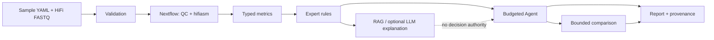

# HiFi Agent

HiFi Agent V1 是一个针对单样本真核 PacBio HiFi 基因组项目的受限组装助手。它验证明确的用户输入，运行确定性质量控制和组装工作流，将工具输出规范化为结构化指标，应用可审核的规则进行 hifiasm 参数决策，并生成包含证据、风险和来源的可重复报告。

V1 故意保守。系统必须在没有 LLM 的情况下工作：Nextflow 运行固定的工作流步骤，Python 解析器产生稳定的 JSON，规则引擎可以接受、停止或提出少量白名单的 hifiasm 候选者。任何可选的 RAG/LLM 层仅限于对已合法操作的解释和排序；它不得创建 shell 命令或引入不支持的参数。

## 十分钟快速开始

无需下载测序数据即可运行真实规则引擎和全部九个便携边界场景：

```bash
python3.12 -m venv .venv
source .venv/bin/activate
python -m pip install -e .
hifi-agent --version
hifi-agent demo /tmp/hifi-agent-demo
sed -n '1,160p' /tmp/hifi-agent-demo/v1_benchmark.md
```

预期结果是 `Scenarios passed: 9/9`。该命令验证 schema、规则、参数白名单、停止策略、
重复一致性和报告输出，但不伪装成生物学组装。完整 Linux/Conda 工作流见
[用户指南](docs/user_guide.md)，开发与测试见[开发者指南](docs/developer_guide.md)。

## 架构与安全边界



规则是唯一的参数决策权威；LLM 不能生成 shell、增加候选或越过四参数白名单。详细职责边界
见[架构说明](docs/architecture.md)和[规则目录](docs/rule_catalog.md)。

## V1 范围

支持：

- 单样本 PacBio HiFi FASTQ 或 FASTQ.GZ 输入。
- 每次运行一个样本的一个或多个读取文件。
- 真核基因组组装，V1 针对二倍体样本优化。
- 使用 hifiasm 的 HiFi-only contig 组装。
- 通过 Nextflow DSL2 进行本地 Linux 执行。
- CLI 优先操作。
- JSON、TSV、Markdown 和可选 HTML 报告。

V1 范围外：

- Hi-C 分相组装。
- 三联体分型。
- ONT 超长辅助组装。
- 自动多倍体参数优化。
- 染色体级支架构建。
- 基因组注释或重复注释。
- 无界参数搜索。
- 让 LLM 直接执行任意 shell 命令。

## 开发基线

- 操作系统目标：Linux。
- 工作流引擎：Nextflow DSL2。
- 主要 Python 环境：conda 环境 `hifiAgent`。
- 分支模型：`main` 加上短期功能分支。
- 项目板列：待办、进行中、审查、完成。
- 问题标签：`workflow`、`parser`、`rule`、`agent`、`test`、`docs`。

当前本地机器基线记录在 [docs/technical_baseline.md](docs/technical_baseline.md) 中。

### 本地资源策略

默认配置面向当前 512 逻辑 CPU、1 TiB 内存的服务器：工作流全局上限为 480 线程和
960 GB 内存，给操作系统、Nextflow 和文件系统缓存预留 32 个逻辑 CPU 与 64 GB。
hifiasm 使用全局上限；meryl、NanoPlot 和组装后 QC 按工具并行能力分级申请资源。
`max_threads` 和 `max_memory_gb` 仍可在样本 YAML 的 `resources` 中覆盖；在其他机器上
运行时应显式设置为该机器可安全提供的容量。

## CLI

```text
hifi-agent validate CONFIG
hifi-agent plan CONFIG
hifi-agent run CONFIG
hifi-agent evaluate RUN_DIR
hifi-agent optimize RUN_DIR
hifi-agent report RUN_DIR
hifi-agent benchmark --output-dir benchmark/reports
hifi-agent demo demo_output
```

CLI 入口已建立。`validate` 已接入阶段 2 配置验证；`run` 会先执行
配置验证，再运行组装和阶段 7 评价；`evaluate` 可对已有 baseline 单独执行阶段 7；
`plan` 命令目前仍是受控占位命令；`report` 已实现阶段 12 的完整报告输出；
`benchmark` 和 `demo` 分别提供阶段 13 的真实数据验收与便携演示。

## 存储库布局

```text
configs/          运行时默认值和阈值
workflow/         Nextflow DSL2 工作流和模块
src/hifi_agent/   Python 包
rules/            可审核的 YAML 规则定义
docs/             项目范围、决策和用户/开发者文档
examples/         小型配置和预期输出示例
tests/            单元、集成、工作流、固定装置和黄金测试
benchmark/        公共数据集注册和基准报告
```

## 第 0 阶段状态

第 0 阶段本地交付物已存在：

- `README.md`
- `docs/project_scope.md`
- `docs/decisions/0001-v1-scope.md`
- `docs/technical_baseline.md`
- `benchmark/datasets.yaml`
- `.github/labels.yml`
- `environment.yml`

外部 GitHub 设置仍需要存储库所有者操作：创建远程存储库、导入标签、创建项目板和打开后续问题。

## 第 1 阶段状态

第 1 阶段本地交付物已存在：

- `pyproject.toml`
- `src/hifi_agent/` Python 包和计划模块目录
- `tests/` 测试目录和 CLI 单元测试
- `.pre-commit-config.yaml`
- `.github/workflows/ci.yml`

在 conda 环境 `hifiAgent` 中已验证：

```text
conda run -n hifiAgent pytest
conda run -n hifiAgent ruff check .
conda run -n hifiAgent ruff format --check .
conda run -n hifiAgent mypy
conda run -n hifiAgent hifi-agent --help
```

## 第 2 阶段状态

第 2 阶段本地交付物已存在：

- `src/hifi_agent/schemas/sample.py`
- `src/hifi_agent/config.py`
- `examples/candida_sample_config.yaml`
- `tests/test_config_validation.py`

`hifi-agent validate CONFIG` 当前会执行：

- Pydantic `SampleConfig`、`ResourceConfig`、`AgentConfig` schema 校验；
- `sample_id` 字符集校验；
- FASTQ/FASTQ.GZ 路径存在性和文件类型校验；
- gzip 完整性校验；
- FASTQ 首条完整记录校验；
- `outdir` 不得包含关键输入文件；
- 线程、内存、重试轮数和候选数预算校验；
- 明确拒绝 Hi-C、ONT、trio 和 ultra-long 等 V1 范围外字段；
- 生成 `00_metadata/resolved_config.yaml`；
- 生成 `00_metadata/input_checksums.tsv`；
- 生成带有元数据摘要的 `00_metadata/validation_receipt.json`，工作流拒绝缺失 receipt 的运行；
- 为 `hifi-agent run` 生成 `00_metadata/hifi_reads.list`，确保工作流使用已验证输入。

已使用本地 `Candida_albicans/Candida_albicans_HIFI.fastq` 验证：

```text
conda run -n hifiAgent hifi-agent validate examples/candida_sample_config.yaml
conda run -n hifiAgent hifi-agent run --resume examples/candida_sample_config.yaml
```

验证输出包含：

- `results/Candida_albicans_phase2/00_metadata/resolved_config.yaml`
- `results/Candida_albicans_phase2/00_metadata/input_checksums.tsv`

## 第 3 阶段状态

第 3 阶段本地交付物已存在：

- `workflow/main.nf`
- `workflow/nextflow.config`
- `workflow/conf/base.config`
- `workflow/conf/local.config`
- `examples/candida_phase3.md`
- `tests/workflow/test_phase3_workflow.py`
- `tests/workflow/test_phase3_nextflow_execution.py`

DSL2 工作流已经从阶段 3 的最小骨架扩展到阶段 4/5 的组装前 QC：

- `FASTQ_PROBE`：检查 FASTQ 四行结构，统计 reads 数和总碱基数；
- `SEQKIT_STATS`：运行 `seqkit stats -a -T`；
- `NANOPLOT`：运行 NanoPlot 并生成 `NanoStats.txt` 与 HTML 图表；
- `KMER_COUNT`：运行 meryl 全量 k-mer 计数并导出 histogram；
- `GENOMESCOPE_SUMMARY`：条件性运行 GenomeScope 2.0；
- `KMER_METRICS`：汇总 histogram 与 GenomeScope 结构化指标；
- `RAW_METRICS`：生成组装前统一 JSON；
- `WRITE_RUN_MANIFEST`：生成 `00_metadata/run_manifest.json`。

已使用本地 `Candida_albicans/Candida_albicans_HIFI.fastq` 通过受验证的 CLI 入口
验证 local profile：

```text
conda run -n hifiAgent hifi-agent run --resume examples/candida_sample_config.yaml
```

验证输出包含：

- `results/Candida_albicans_phase2/00_metadata/run_manifest.json`
- `results/Candida_albicans_phase2/01_pre_qc/fastq_probe/fastq_probe.tsv`
- `results/Candida_albicans_phase2/logs/trace.txt`
- `results/Candida_albicans_phase2/logs/timeline.html`
- `results/Candida_albicans_phase2/logs/report.html`
- `results/Candida_albicans_phase2/logs/dag.html`

`-resume` 已验证，成功任务会以 cached 状态复用。运行 Nextflow 时默认使用
`/home/gw/software/jdk21/bin/java`。

`tests/workflow/test_nextflow_resume_acceptance.py` 会在第二个进程运行时终止 Nextflow，
随后以 `-resume` 恢复，并断言已完成的第一步状态为 `CACHED`、发布结果未丢失。

## 第 4 阶段状态

第 4 阶段本地交付物已存在：

- `workflow/main.nf` 中的 `SEQKIT_STATS`、`NANOPLOT` 和 `RAW_METRICS` process
- `src/hifi_agent/parsers/seqkit.py`
- `src/hifi_agent/parsers/nanoplot.py`
- `src/hifi_agent/workflow_tools.py`
- `tests/test_pre_qc_parsers.py`

当前 workflow 会生成：

- `results/<sample>/01_pre_qc/seqkit/seqkit_stats.tsv`
- `results/<sample>/01_pre_qc/nanoplot/NanoStats.txt`
- `results/<sample>/01_pre_qc/raw_metrics.json`

`SEQKIT_STATS` 使用 `seqkit stats -a -T`。`NANOPLOT` process 真实调用 NanoPlot，
输出 `NanoStats.txt`、HTML 报告和 read length 图；parser 只解析 `NanoStats.txt`，
不解析 HTML 视觉内容。

## 第 5 阶段状态

第 5 阶段本地交付物已存在：

- `workflow/main.nf` 中的 `KMER_COUNT`、`GENOMESCOPE_SUMMARY` 和 `KMER_METRICS` process
- `src/hifi_agent/parsers/kmer.py`
- `src/hifi_agent/parsers/genomescope.py`
- `tests/test_pre_qc_parsers.py`

当前 workflow 会生成：

- `results/<sample>/01_pre_qc/kmer/kmer_histogram.tsv`
- `results/<sample>/01_pre_qc/kmer/read.meryl/`
- `results/<sample>/01_pre_qc/kmer/genomescope_summary.tsv`
- `results/<sample>/01_pre_qc/kmer/kmer_metrics.json`

k-mer 默认配置在 sample config 的 `kmer` 字段中：

```yaml
kmer:
  k: 21
```

`KMER_COUNT` 使用 meryl 对全部 HiFi reads 计数并导出 histogram。V1 当前将 HiFi reads
本身作为 k-mer 来源，标记为 `same_data_advisory`。coverage 优先使用用户提供的
`expected_genome_size`；如果该值缺失且 GenomeScope 成功，则回退使用 GenomeScope
估计的 `genome_size`；如果两者都不可用，则 `estimated_coverage` 为 `null` 并写入
warning。`GENOMESCOPE_SUMMARY` 会条件性调用 GenomeScope；如果 GenomeScope 依赖缺失
或拟合失败，只记录 `genomescope_model_status`、退出码和 warning，不编造 genome size、
heterozygosity、repeat fraction 或 model fit。
低覆盖峰阈值由 `kmer.low_coverage_peak_threshold` 配置，默认 10×。

## 第 6 阶段状态

第 6 阶段本地交付物已存在：

- `workflow/main.nf` 中的 `HIFIASM_BASELINE` process
- `src/hifi_agent/parsers/hifiasm_log.py`
- `src/hifi_agent/workflow_tools.py` 中的 `hifiasm-manifest` helper
- `tests/test_pre_qc_parsers.py` 中的 hifiasm log parser 测试

baseline assembly 默认只设置 hifiasm 输出前缀和线程：

```text
hifiasm -o <sample_id>.baseline -t <cpus> <reads>
```

当前 workflow 会生成：

- `results/<sample>/02_assembly/baseline/gfa/*.gfa`
- `results/<sample>/02_assembly/baseline/fasta/baseline.primary.fa`
- `results/<sample>/02_assembly/baseline/fasta/baseline.hap1.fa`
- `results/<sample>/02_assembly/baseline/fasta/baseline.hap2.fa`
- `results/<sample>/02_assembly/baseline/bins/*.bin`
- `results/<sample>/02_assembly/baseline/logs/hifiasm.stdout`
- `results/<sample>/02_assembly/baseline/logs/hifiasm.stderr`
- `results/<sample>/02_assembly/baseline/logs/hifiasm.time.txt`
- `results/<sample>/02_assembly/baseline/metadata/assembly_manifest.json`

`assembly_manifest.json` 记录 hifiasm 命令、版本、homozygous coverage threshold、
runtime、peak RSS、GFA/FASTA/bin 输出位置和 warning。重跑时如果
`02_assembly/baseline/bins/` 中已有相同 prefix 的 `.bin`，process 会先复制到工作目录，
让 hifiasm 可以复用兼容中间文件。tiny workflow smoke test 可用 `--run_assembly false`
跳过 assembly；正式样本默认运行 baseline assembly。

复用候选现在通过带 SHA-256 的 `hifiasm_bin_reuse_candidates.tsv` 声明为工作流输入；
验收要求 hifiasm 日志出现 `loaded corrected reads and overlaps from disk`。

## 第 7 阶段状态

第 7 阶段组装后多维 QC 已接入 `workflow/main.nf`：

- `QUAST`：默认 reference-free；存在 `reference_genome` 时增加 reference-based 模式；
  预期基因组不小于 100 Mb 时自动使用 `--large`；
- `BUSCO_POST_QC`：优先使用显式 lineage，缺失时使用 `--auto-lineage-euk`，不存在的
  数据集由 BUSCO 自动下载；
- `MERQURY_POST_QC`：复用阶段 5 meryl 数据库，保留 QV、completeness 和 spectrum；
- `MAPPING_POST_QC`：先按 `mapping_qc` 中的长度和平均 Q 值阈值过滤 reads，再使用
  minimap2 `map-hifi`、samtools，以及 mosdepth 或
  bedtools windows + `samtools bedcov` 统计覆盖；
- `ASSEMBLY_METRICS`：生成统一的 `assembly_metrics.json`。

四条评价支路分别捕获工具退出码；单个工具失败不会阻断其他指标，缺失值为 `null`。
提供 `kmer_reads` 时标记 `independent_high_confidence`，否则标记
`same_data_advisory` 并在结果中保留非独立性限制。
BUSCO 自动谱系模式会从 specific summary 中记录实际 lineage，并保存 ODB 版本、
数据集创建日期和 `dataset.cfg` 来源。最终 `metric_classes` 覆盖全部标量组装指标。

```text
hifi-agent run --resume CONFIG
hifi-agent evaluate results/<sample_id>
```

`evaluate` 只运行阶段 7，不重跑 pre-QC 或 hifiasm。输出结构：

```text
03_post_qc/baseline/
├── assembly_metrics.json
├── quast/
├── busco/
├── merqury/
└── mapping/
```

## 第 8 阶段规则决策

阶段 8 使用版本化 YAML 专家规则和阈值，不依赖 LLM：

```text
hifi-agent decide results/<sample_id>
```

结果写入 `04_decisions/baseline/rule_decision.json`，只会产生 `BASELINE`、`STOP` 或
`RETRY`。候选参数严格限制为 `purge_level`、`purge_similarity`、`hom_cov` 和
`disable_post_join`。规则、阈值与冲突策略见
[`docs/stage8_expert_rules.md`](docs/stage8_expert_rules.md)。

## 第 9 阶段 Agent 控制器

对已完成阶段 1～8 的运行目录启动显式、无 LLM 控制器：

```text
hifi-agent agent results/<sample_id>
hifi-agent agent results/<sample_id> --resume
```

状态快照、逐转移审计日志和执行摘要分别写入：

```text
05_agent/agent_state.json
05_agent/decision_trace.jsonl
05_agent/agent_summary.json
```

控制器分别限制参数优化轮数、每轮候选数、工具失败重试、CPU-hour 和 walltime；参数
指纹防止相同候选重复运行。工具失败只进入工具重试或 `FAILED_TOOL_EXECUTION`，不会被
解释为生物学质量退化。状态与预算细节见
[`docs/stage9_agent_controller.md`](docs/stage9_agent_controller.md)。
严格验收证据见 [`docs/stage9_acceptance.md`](docs/stage9_acceptance.md)。

## 第 10 阶段 RAG 与受约束解释

构建 `document/` 本地知识索引，并对阶段 8 决策生成可追溯解释：

```text
hifi-agent rag-index
hifi-agent explain results/<sample_id> --no-llm
hifi-agent explain results/<sample_id> --llm
```

LLM 模式默认使用 `DEEPSEEK_API_KEY` 和 OpenAI 兼容的 `deepseek-v4-pro`。规则 decision、
参数候选和阶段 9 预算始终不可修改；模型输出需通过 Schema、来源、参数、置信度和科学单位
校验。输出包括 `explanation.json/.md`、`rag_comparison.json` 和带 source/chunk ID 的
`rag_decision_trace.jsonl`。详见 [`docs/stage10_rag_llm.md`](docs/stage10_rag_llm.md) 与
[`docs/stage10_acceptance.md`](docs/stage10_acceptance.md)。

## 第 11 阶段有限闭环优化

阶段 11 在阶段 8 专家规则明确授权 `RETRY` 时生成最多两个白名单候选，默认只允许一轮：

```text
hifi-agent optimize results/<sample_id>
hifi-agent optimize results/<sample_id> --execute --confirm-medium-high-risk
```

真实执行入口会校验并重命名复用 baseline hifiasm `.bin`，然后让 candidate 经过与 baseline
完全相同的 QUAST、BUSCO、Merqury、mapping 和 `ASSEMBLY_METRICS` 流程。比较器覆盖 size
ratio、BUSCO、k-mer、mapping、coverage CV、N50 和 misassembly；被支配候选、工具失败和
核心质量回退均不能被 N50 提升覆盖。输出位于 `05_agent/optimization/`。

Candida albicans 人工异常由真实 baseline 指标及其 SHA-256 派生：

```text
hifi-agent synthesize-stage11-anomaly results/Candida_albicans_phase6
hifi-agent optimize results/Candida_albicans_phase6 \
  --scenario benchmark/perturbations/candida_albicans_stage11_closed_loop.json
```

该场景只用于闭环安全验收，并强制标注为 synthetic。详见
[`docs/stage11_closed_loop.md`](docs/stage11_closed_loop.md) 与
[`docs/stage11_acceptance.md`](docs/stage11_acceptance.md)。

## 第 12 阶段报告系统

从一个已有运行目录生成 Markdown、机器可读摘要、比较表、参数差异、来源清单、软件版本、
复现命令和统一图表目录：

```text
hifi-agent report results/<sample_id>
hifi-agent report results/<sample_id> --show-absolute-paths
```

默认隐藏本机绝对路径。失败或不完整运行也会生成报告，并将模块明确标记为 `FAILED`、
`WARNING` 或 `NOT_RUN`；缺失指标写为 `null`/`NA (not available)`，不会伪装成 0。
输出位于 `05_report/`：

```text
final_report.md
final_summary.json
comparison.tsv
parameter_diff.tsv
provenance.tsv
software_versions.tsv
reproducible_commands.txt
figures/
```

用于报告验收的 Candida albicans 人工异常通过真实 baseline 指标确定性派生，并在文件和
报告中强制标注为 synthetic，不能作为科学结果：

```text
hifi-agent synthesize-report-anomaly results/Candida_albicans_phase6
hifi-agent report results/Candida_albicans_phase6 \
  --scenario benchmark/perturbations/candida_albicans_quality_regression.json \
  --output-dir results/Candida_albicans_phase6/05_report_synthetic
```

实现说明与严格验收证据见 [`docs/stage12_reporting.md`](docs/stage12_reporting.md) 和
[`docs/stage12_acceptance.md`](docs/stage12_acceptance.md)。

## 第 13 阶段测试、Benchmark 与消融

```bash
pytest --cov --cov-report=term-missing --cov-fail-under=80
hifi-agent benchmark --output-dir benchmark/reports \
  --real-run-dir results/Candida_albicans_phase6
```

当前验收为 199 passed、12 个显式条件测试 skipped，安全关键范围覆盖率 82.06%。十个自动
场景全部通过，不存在 hifiasm 参数率为 0%，重复一致率为 100%。公开结果见
[`benchmark/reports/v1_benchmark.md`](benchmark/reports/v1_benchmark.md)，包含默认 hifiasm、
固定 pipeline、规则系统、规则+RAG/LLM 四种方法，以及去除 RAG、仅看 N50、去除工具失败
门禁三组消融。真实案例使用 FASTQ 头部记录的 `SRR23724250` 和参考序列 `CP128823.1`；
人工扰动均明确标为非科学结果。

## 第 14 阶段发布候选

V1.0.0 本地发布物包括 [CHANGELOG](CHANGELOG.md)、[CITATION](CITATION.cff)、
[发布说明](docs/releases/v1.0.0.md)、[发布清单](docs/release_checklist.md)、
[演示](docs/demo.md)和[面试问答](docs/interview_qa.md)。`main` 与 `v1.0.0` 发布标签已推送到
[`mysilicons/HiFiAgent`](https://github.com/mysilicons/HiFiAgent)。正式 GitHub Release：
[`v1.0.0`](https://github.com/mysilicons/HiFiAgent/releases/tag/v1.0.0)。发布后状态审计记录在
[`docs/stage14_acceptance.md`](docs/stage14_acceptance.md)。

## V1 限制

- 仅支持单样本、HiFi-only、二倍体导向的 contig 组装。
- 不支持 Hi-C、trio、ONT、多倍体自动优化、scaffolding 或注释。
- 同源 HiFi reads 的 k-mer 指标属于 advisory evidence，不等同独立验证。
- RAG/LLM 只能解释，API 故障不会改变规则决定。
- Candida Stage 11 候选是从真实 baseline 指标派生的显式 synthetic 安全测试，不能用于科研。
