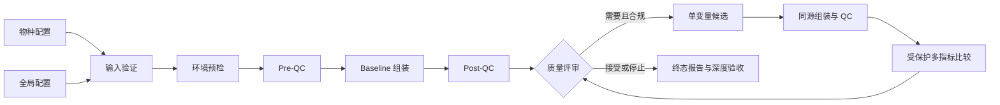

<div align="center">

# HiFi Agent

**面向单样本 PacBio HiFi 数据的受约束、可恢复、可审计基因组组装助手**

从 FASTQ 到组装、质量评估、有限参数优化与终态报告，只需一个物种配置和一条命令。

[](https://github.com/mysilicons/HiFiAgent/actions/workflows/ci.yml)
[](https://github.com/mysilicons/HiFiAgent/releases/latest)
[](https://www.python.org/)
[](LICENSE)

[快速开始](#快速开始) · [配置说明](#两层配置) · [结果与验收](#结果与验收) · [用户文档](#文档) · [参与贡献](CONTRIBUTING.md)

</div>

---

HiFi Agent 将生产级组装流程中的输入验证、环境预检、pre-QC、hifiasm 组装、post-QC、受控参数
搜索、结果比较和审计报告统一到一个命令中。它不会让模型直接执行命令，也不会进行无边界参数
搜索；每个候选都必须通过固定 Schema、证据授权、安全仲裁、预算和参数合同。

> [!IMPORTANT]
> 当前范围是 Linux x86_64 上的单样本 PacBio HiFi 组装。Hi-C、ONT、trio、scaffolding、注释和
> 临床用途不在支持范围内。输出表示“已执行候选中的最佳证据”，不代表全局参数最优。

## 核心能力

| 能力 | 说明 |
|---|---|
| 一条命令运行 | 只指定物种 YAML；首次运行创建任务，再次运行自动安全续跑 |
| 两层严格配置 | 全局环境与物种科学信息完全分离，未知字段直接拒绝 |
| 输入与环境门禁 | FASTQ、gzip、路径、SHA-256、工具版本、CPU、内存、磁盘和 BUSCO 谱系预检 |
| 统一组装边界 | baseline 和 candidate 共用同一执行器、Nextflow 流程与 post-QC 合同 |
| 有界参数优化 | 最多三轮、每轮最多两个候选、单候选只允许改变一个受控参数 |
| 受保护指标比较 | BUSCO、k-mer、mapping 和 coverage 回退不能被 N50 提升覆盖 |
| 安全恢复 | immutable identity、事务状态日志、单写者锁、幂等预算与 attempt-local cache |
| 完整审计 | requested → approved → argv → realized 参数，以及 proposal → attempt → comparison 链 |
| 终态深度验收 | 报告、manifest、哈希链、参数合同和产物 inventory 自动验证 |

## 工作流程



## 系统要求

- Python `3.12`
- Linux x86_64
- Java `21` 与 Nextflow `25.04.7`
- hifiasm、gfatools、SeqKit、NanoPlot、meryl、QUAST、BUSCO、Merqury
- minimap2、samtools、bedtools 或 mosdepth、R、GenomeScope

真实项目的 CPU、内存和磁盘需求取决于基因组大小、覆盖度与候选数量。提交任务前，`plan` 会验证
配置资源是否超过当前主机能力。

## 安装

推荐使用仓库提供的 Conda 环境，以固定外部生物信息学工具版本：

```bash
git clone https://github.com/mysilicons/HiFiAgent.git
cd HiFiAgent
conda env create -f environment.yml
conda activate hifiAgent
python -m pip install .
```

也可以从 [GitHub Releases](https://github.com/mysilicons/HiFiAgent/releases/latest) 下载 wheel：

```bash
python -m pip install hifi_agent-3.0.0-py3-none-any.whl
```

wheel 只安装 Python 包；外部组装和 QC 工具仍需由 Conda 或系统环境提供。

## 快速开始

将数据放入全局 `data_root` 对应目录，例如：

```text
Data/
└── Malus_domestica/
    └── Malus_domestica_HiFi.fastq
```

仓库已经提供 [全局配置](configs/runtime.yaml) 和四个[物种示例](configs/samples)。先进行只读规划：

```bash
conda run --no-capture-output -n hifiAgent \
  hifi-agent plan configs/samples/Malus_domestica.yaml
```

确认环境通过后启动完整流程：

```bash
conda run --no-capture-output -n hifiAgent \
  hifi-agent assemble configs/samples/Malus_domestica.yaml
```

进程中断时，重新执行完全相同的命令即可。默认 `resume_mode: auto` 会验证配置快照、输入 checksum、
run identity 和事务状态后，从原 attempt 安全恢复。

### 无真实数据的可移植演示

下面的命令会创建最小 FASTQ 和隔离 fixture 工具链，经由真实 CLI、控制器、文件合同和报告边界完成
baseline 加三轮候选，可用于快速确认安装是否完整：

```bash
python scripts/run_portable_demo.py --workspace /tmp/hifi-agent-portable --scenario three-rounds
```

fixture 指标只验证软件 wiring，不能作为真实生物学结果。

## 两层配置

### 1. 全局环境配置

全局文件维护数据、输出和缓存根目录，以及所有样本共享的资源、优化、预算和工具策略。相对路径按
该配置文件所在目录解析。

```yaml
schema_id: hifi-agent-runtime

paths:
  data_root: ../Data
  output_root: ../results
  cache_root: ../cache/hifi-agent

resources:
  max_threads: 128
  max_memory_gb: 960

optimization:
  enabled: true
  max_rounds: 1
  max_candidates_per_round: 1
  minimum_candidate_runs: 1
  max_parameter_changes_per_candidate: 1
  plateau_rounds: 1
  decision_mode: rules_only
  require_llm: false
  confirm_risk_level: medium_high
  retain_all_attempts: true

execution_budget:
  max_total_assemblies: 2
  max_tool_retries: 1
  max_cpu_hours: 30000
  max_walltime_hours: 336
  min_free_disk_gib: 1000
  max_llm_calls_per_round: 0
  max_total_llm_calls: 0

tools:
  busco_cache: busco
  coverage_backend: bedtools
  download_missing_busco: true

runtime:
  resume_mode: auto
  retention: standard
```

### 2. 物种配置

物种文件只描述输入与科学事实。所有输入必须是 `data_root` 下的安全相对路径。

```yaml
schema_id: hifi-agent-sample
runtime_config: ../runtime.yaml
sample_id: Malus_domestica
read_technology: pacbio_hifi

hifi_reads:
  - Malus_domestica/Malus_domestica_HiFi.fastq

species_name: Malus domestica
expected_genome_size: 650000000
ploidy: 2
inbred: null
busco_lineage: eudicots_odb12
kmer_reads: null
reference_genome: null
```

新物种只需复制一个样本文件并修改以下字段：

- `sample_id`：字母、数字、下划线或连字符；
- `hifi_reads`：一个文件或多个 FASTQ/FASTQ.GZ；
- `species_name`、`expected_genome_size`、`ploidy` 和 `inbred`；
- `busco_lineage`：最接近的 BUSCO 分类谱系；
- `reference_genome`：可选参考基因组，相对于 `data_root`。

无需为每个物种重复线程、内存、工具路径和预算设置。缺失的 BUSCO lineage 会在共享缓存中加锁下载。

## 命令行

| 命令 | 用途 |
|---|---|
| `hifi-agent validate SAMPLE.yaml` | 验证配置和输入，并生成 checksum/receipt |
| `hifi-agent plan SAMPLE.yaml` | 只读解析配置并执行环境预检 |
| `hifi-agent assemble SAMPLE.yaml` | 执行或自动恢复完整组装闭环 |
| `hifi-agent verify-run RUN_DIR --deep` | 重新验证 identity、日志、预算、合同与产物 |
| `hifi-agent --help` | 查看完整命令和高级选项 |

默认 `rules_only` 不需要 API。`hybrid` 模式只允许模型生成严格 JSON proposal；模型没有执行端口，
所有提案仍需经过相同的证据、安全、预算和参数合同门禁。

## 输出目录

```text
results/<sample_id>/
├── 00_metadata/       # 配置快照、输入 checksum、identity、环境与保留策略回执
├── 01_pre_qc/         # reads 与 k-mer 预评估
├── 02_assembly/       # baseline 和所有 candidate attempt
├── 03_post_qc/        # 统一 QC 产物
├── 04_decisions/      # 规则、证据、proposal、安全决定与比较
├── 05_agent/          # 权威状态、事件、预算、manifest history 与单写者锁
└── 06_report/         # 终态 Markdown、JSON、TSV 与 verification report
```

`retention: standard` 只在进入终态且 deep verification 为 `PASS` 后删除可再生的 workflow work
目录；assembly、QC、参数、日志和审计证据都会保留。

## 结果与验收

终态后首先检查：

```bash
hifi-agent verify-run results/Malus_domestica --deep
```

然后阅读：

- `06_report/final_report.md`：面向人的总结；
- `06_report/final_summary.json`：机器可读终态与 incumbent；
- `06_report/all_runs.tsv`：全部 attempt 和关键指标；
- `06_report/all_parameters.tsv`：requested/approved/rendered/realized 参数；
- `06_report/provenance.tsv`：输入、决策、运行和比较来源；
- `06_report/verification_report.json`：完整性验收结果。

| 退出码 | 含义 |
|---:|---|
| `0` | 科学流程正常接受或停止；不表示全局最优 |
| `2` | 输入或配置验证失败 |
| `3` | 需要人工动作，例如预算或风险确认 |
| `4` | 工具、参数合同或完整性失败 |
| `5` | 配置为必需的外部决策服务失败 |

## 项目结构

```text
HiFiAgent/
├── configs/           # 全局运行配置、样本模板与比较策略
├── docs/              # 用户指南、架构和专家规则
├── examples/          # 最小配置示例
├── scripts/           # 可移植演示
├── src/hifi_agent/    # Python 包、Nextflow 和治理知识快照
├── tests/             # 单元、集成、恢复与工作流测试
├── environment.yml    # 推荐 Conda 环境
└── pyproject.toml     # Python 包与质量门禁
```

## 文档

- [快速开始](docs/quickstart.md)
- [配置与决策模式](docs/decision-modes.md)
- [资源与预算](docs/resource-budgets.md)
- [自动续跑与故障恢复](docs/resume-and-recovery.md)
- [结果解释](docs/result-interpretation.md)
- [系统架构](docs/architecture.md)
- [专家规则标准](docs/expert_rules.md)

## 参与贡献

欢迎提交 issue 和 pull request。开始开发前请阅读 [CONTRIBUTING.md](CONTRIBUTING.md)，并确保变更
通过 Ruff、MyPy、pytest、覆盖率和可移植闭环测试。请勿提交 FASTQ、BAM/CRAM、组装数据库、BUSCO
下载、API key 或包含个人绝对路径的运行产物。

## 引用

项目信息位于 [CITATION.cff](CITATION.cff)。GitHub 页面可通过 **Cite this repository** 导出引用。

## 许可证

本项目采用 [MIT License](LICENSE)。第三方生物信息学工具与数据遵循各自的许可证和使用条款。
