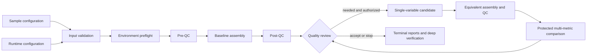

<div align="center">

**English** | [简体中文](README.zh-CN.md)

# HiFi Agent

**A constrained, recoverable, and auditable genome assembly assistant for single-sample PacBio HiFi data**

From FASTQ to assembly, quality assessment, bounded parameter optimization, and terminal reports: one sample configuration, one command.

[](https://github.com/mysilicons/HiFiAgent/actions/workflows/ci.yml)
[](https://github.com/mysilicons/HiFiAgent/releases/latest)
[](https://www.python.org/)
[](LICENSE)

[Quick start](#quick-start) · [Configuration](#two-layer-configuration) · [Verification](#results-and-verification) · [Documentation](#documentation) · [Contributing](CONTRIBUTING.md)

</div>

---

HiFi Agent combines input validation, environment preflight, pre-QC, hifiasm assembly,
post-QC, constrained parameter search, protected multi-metric comparison, and audit reporting
in a deterministic control plane. A model cannot execute commands: every candidate must pass a
fixed schema, evidence authorization, deterministic safety arbitration, budgets, and parameter
round-trip contracts.

> [!IMPORTANT]
> The supported scope is single-sample PacBio HiFi assembly on Linux x86_64. Hi-C, ONT, trio,
> scaffolding, annotation, population analysis, and clinical use are outside the supported scope.
> The selected result is the best supported among executed candidates; it is not a claim of global
> optimality and does not replace independent biological validation.

## Why HiFi Agent

| Capability | Behavioral guarantee |
|---|---|
| One-command lifecycle | `assemble` creates a run or safely resumes it according to policy |
| Strict two-layer configuration | Shared runtime settings are separated from sample facts; unknown fields are rejected |
| Input and environment gates | FASTQ/gzip, SHA-256, versions, CPU, memory, disk, and BUSCO cache are checked |
| Unified execution boundary | Baseline and candidates use the same executor, Nextflow entry point, and post-QC contract |
| Bounded optimization | At most three rounds, two candidates per round, and one allowlisted change per candidate |
| Protected comparison | N50 gains cannot override BUSCO, k-mer, mapping, or coverage regressions |
| Transactional recovery | Immutable identity, append-only records, a single-writer lock, and idempotent budgets |
| Full auditability | Requested → approved → argv → realized parameters and incumbent history are retained |
| Deep verification | Hashes, logs, budgets, contracts, inventories, reports, and provenance are recomputed |

## Workflow



## Requirements

- Linux x86_64 and Python `3.12`;
- Java `21` and Nextflow `25.04.7`;
- hifiasm, gfatools, SeqKit, NanoPlot, meryl, QUAST, BUSCO, and Merqury;
- minimap2, samtools, bedtools or mosdepth, R, and GenomeScope.

The checked [Conda environment](environment.yml) pins the validated toolchain. Real resource
requirements depend on genome size, coverage, heterozygosity, and candidate count. Adjust the
runtime configuration to the host before starting; `plan` rejects requests beyond available CPU,
memory, or the disk reserve.

## Installation

```bash
git clone https://github.com/mysilicons/HiFiAgent.git
cd HiFiAgent
conda env create -f environment.yml
conda activate hifiAgent
python -m pip install .
hifi-agent --version
```

Alternatively, download a wheel from [GitHub Releases](https://github.com/mysilicons/HiFiAgent/releases/latest):

```bash
python -m pip install ./hifi_agent-*.whl
```

The wheel contains the Python package, production Nextflow workflow, comparison policy, and
governed knowledge. External bioinformatics tools must still be supplied by Conda or the system.

## Quick start

Place input under the runtime configuration's `data_root`:

```text
Data/
└── sample/
    └── reads.fastq.gz
```

Edit `configs/runtime.yaml` for the host and `configs/sample.yaml` for the sample, then run:

```bash
hifi-agent validate configs/sample.yaml
hifi-agent plan configs/sample.yaml
hifi-agent assemble configs/sample.yaml
```

With the default `resume_mode: auto`, run the same `assemble` command after interruption. The
application validates configuration snapshots, input checksums, run identity, transaction records,
and attempt cache before resuming; identity drift is rejected.

For a data-free functional demonstration:

```bash
python scripts/run_portable_demo.py --workspace /tmp/hifi-agent-portable --scenario three-rounds
```

This exercises the real CLI, controller, file contracts, comparator, and reporting boundaries with
fixture tools. It validates software wiring, not biological quality.

## Two-layer configuration

`configs/runtime.yaml` owns shared paths, resources, optimization, budgets, tools, and recovery:

```yaml
schema_id: hifi-agent-runtime
paths:
  data_root: ../Data
  output_root: ../results
  cache_root: ../cache/hifi-agent
resources:
  max_threads: 32
  max_memory_gb: 128
optimization:
  enabled: true
  max_rounds: 1
  max_candidates_per_round: 1
  minimum_candidate_runs: 1
  max_parameter_changes_per_candidate: 1
  plateau_rounds: 1
  decision_mode: rules_only
  require_llm: false
  confirm_risk_level: medium_high
  retain_all_attempts: true
execution_budget:
  max_total_assemblies: 2
  max_tool_retries: 1
  max_cpu_hours: 10000
  max_walltime_hours: 168
  min_free_disk_gib: 100
  max_llm_calls_per_round: 0
  max_total_llm_calls: 0
tools:
  busco_cache: busco
  coverage_backend: bedtools
  download_missing_busco: true
kmer:
  k: 21
  low_coverage_peak_threshold: 10.0
mapping_qc:
  min_read_length: 1000
  min_mean_qscore: 20.0
  coverage_window_size: 10000
runtime:
  resume_mode: auto
  retention: standard
```

`configs/sample.yaml` contains input locations and scientific facts only. Input paths are safe paths
relative to `data_root`:

```yaml
schema_id: hifi-agent-sample
runtime_config: runtime.yaml
sample_id: sample_001
read_technology: pacbio_hifi
hifi_reads:
  - sample/reads.fastq.gz
species_name: null
expected_genome_size: null
ploidy: null
inbred: null
busco_lineage: null
kmer_reads: null
reference_genome: null
```

Fill known facts and leave unknown values as `null`; do not guess ploidy, genome size, or inbreeding.
See the [configuration reference](docs/configuration-reference.md) for every field and path rule.

## Command line

| Command | Purpose |
|---|---|
| `hifi-agent validate SAMPLE.yaml` | Validate configuration and inputs; create checksums and a receipt |
| `hifi-agent plan SAMPLE.yaml` | Resolve configuration and run a read-only environment preflight |
| `hifi-agent assemble SAMPLE.yaml` | Create or resume the production assembly lifecycle |
| `hifi-agent verify-run RUN_DIR --deep` | Verify identity, records, budgets, contracts, inventories, and reports |
| `hifi-agent check-dataset REGISTRY ID` | Resolve and hash an external real-data dataset |
| `hifi-agent verify-real RUN_DIR REGISTRY ID` | Apply strict engineering and scientific acceptance to a real run |
| `hifi-agent live-smoke RUN_DIR OUTPUT_DIR` | Smoke-test an external provider using governed context |
| `hifi-agent build-evidence ...` | Build a release evidence bundle bound to code, wheel, and real run |

See the [CLI reference](docs/cli-reference.md) for options, environment variables, and stable exits.

## Output layout

```text
results/sample_001/
├── 00_metadata/       # configuration, checksums, identity, environment, retention receipts
├── 01_pre_qc/         # read and k-mer pre-assessment
├── 02_assembly/       # baseline and candidate attempts
├── 03_post_qc/        # uniform post-QC artifacts
├── 04_decisions/      # rules, evidence, proposals, safety decisions, comparisons
├── 05_agent/          # authoritative state, events, budgets, history, single-writer lock
└── 06_report/         # Markdown, JSON, TSV, and verification reports
```

`retention: standard` removes only reproducible workflow work after terminal deep verification.
Assembly, QC, parameters, logs, and audit evidence remain available.

## Results and verification

```bash
hifi-agent verify-run results/sample_001 --deep
```

Interpret scientific metrics only after `PASS` or an understood `WARNING`. Review
`final_report.md`, `final_summary.json`, `all_runs.tsv`, `all_parameters.tsv`, `provenance.tsv`, and
`verification_report.json` together. Exit `0` is a policy-controlled scientific stop or acceptance,
not proof of global optimality; exits `2`, `3`, `4`, and `5` mean validation failure, required human
action, engineering/integrity failure, and required-provider failure respectively.

## Documentation

| English (default) | 简体中文 |
|---|---|
| [Quick start](docs/quickstart.md) | [快速开始](docs/zh-CN/quickstart.md) |
| [Configuration reference](docs/configuration-reference.md) | [配置参考](docs/zh-CN/configuration-reference.md) |
| [CLI reference](docs/cli-reference.md) | [CLI 参考](docs/zh-CN/cli-reference.md) |
| [Decision modes](docs/decision-modes.md) | [决策模式](docs/zh-CN/decision-modes.md) |
| [Resource budgets](docs/resource-budgets.md) | [资源与预算](docs/zh-CN/resource-budgets.md) |
| [Resume and recovery](docs/resume-and-recovery.md) | [自动续跑与故障恢复](docs/zh-CN/resume-and-recovery.md) |
| [Result interpretation](docs/result-interpretation.md) | [结果解释](docs/zh-CN/result-interpretation.md) |
| [Troubleshooting](docs/troubleshooting.md) | [故障排查](docs/zh-CN/troubleshooting.md) |
| [Architecture](docs/architecture.md) | [系统架构](docs/zh-CN/architecture.md) |
| [Expert rules](docs/expert_rules.md) | [专家规则](docs/zh-CN/expert_rules.md) |
| [Real-data acceptance](docs/real-data-acceptance.md) | [真实数据验收](docs/zh-CN/real-data-acceptance.md) |

## Contributing, citation, and license

Read [CONTRIBUTING.md](CONTRIBUTING.md) before opening a change. Do not commit sequencing data,
assembly databases, BUSCO downloads, credentials, run outputs, or identifiable absolute paths.
Citation metadata is in [CITATION.cff](CITATION.cff). HiFi Agent is licensed under the
[MIT License](LICENSE); third-party tools and data retain their own terms.
