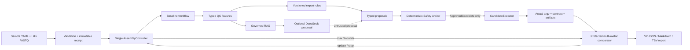

# V2 architecture



The trust boundary is deliberate. Nextflow executes fixed processes; parsers normalize evidence;
rules and the Safety Arbiter authorize candidates; the controller enforces state, round, and
resource budgets. DeepSeek can propose only typed whitelist changes. It cannot create an approval,
execute a process, change the incumbent, or override a stop.

Each round records immutable proposal, approval/rejection, attempt, actual argv, parsed parameter
contract, metrics, policy version, comparison, budget, and event lineage. Historical folders are
never overwritten. A unique safe material improvement may update the incumbent; hard regression,
plateau, conflict, insufficient evidence, budget, or the third-round limit stops automation.

Reports consume those artifacts rather than reconstructing intent. Therefore a reviewer can trace:

```text
proposal → arbiter decision → approved parameters → execution manifest/argv
        → parsed parameters → QC artifacts/metrics → comparison → terminal outcome
```

Biological files remain outside Git. Only small schemas, fixtures, policies, audit summaries,
checksums, and redacted reports are release assets.
