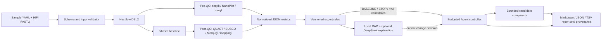

# Architecture

HiFi Agent separates execution, scientific evidence, decisions, explanations, and reports.

The trust boundary is deliberate: Nextflow executes fixed commands; parsers normalize outputs;
rules alone authorize actions; the controller enforces state and compute budgets; the LLM only
explains an already legal outcome. The four V1 hifiasm knobs are `purge_level`,
`purge_similarity`, `hom_cov`, and `disable_post_join`.

Data flows through immutable artifacts under `00_metadata` to `05_report`. Engineering failures
enter `FAILED_TOOL_EXECUTION`; evidence conflicts or missing metrics stop automation instead of
being silently converted to biological conclusions.
