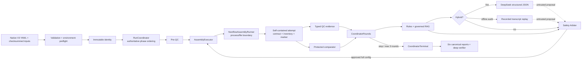

# V3 architecture



## 边界与所有权

- `RunCoordinator` 是唯一生产控制器，只拥有 phase ordering、single-writer lock 和终态入口；
- `RunState` 是唯一权威 snapshot；event、budget 和 manifest history 是可对账审计记录，不是第二状态机；
- `CoordinatorRounds` 负责 baseline review、round context、比较和 incumbent 更新，不提供独立 run loop；
- `CoordinatorTerminal` 负责报告、深度验证与缺失报告恢复；
- `coordinator_support.py` 负责 typed artifact I/O，`coordinator_models.py` 只定义 ports/result；
- baseline/candidate 共用 `AssemblyExecutor` 和同一个 Nextflow `ASSEMBLY_ATTEMPT` entry；
- provider、recorded replay 和 RAG 都没有执行能力，只有 Safety Arbiter 可产生 approved full config；
- attempt 是 canonical 隔离单元，resume 复用其 cache，retry 新建 attempt，完成 marker 最后写。

完整证据链为：

```text
input checksum → identity → state/event/budget → decision context
→ rule/retrieval/LLM receipt → safety decision → approved full config
→ rendered/realized argv contract → inventory/marker → QC metrics
→ comparison/incumbent chain → terminal reports → deep verification
```

Stage-8 executable fixture 与真实工具使用相同进程和文件边界，仅替换显式配置的工具二进制。它不绕过
preflight、executor、parser、comparator 或 reporter，也不作为阶段 9 的真实生物数据证据。
