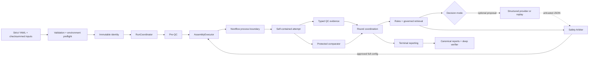

# System Architecture

**English** | [简体中文](zh-CN/architecture.md)

HiFi Agent separates the production control plane, external tool execution, scientific decisions,
and audit evidence. One authoritative state machine owns the lifecycle; Nextflow schedules tools
inside an attempt; a model may only return an untrusted structured proposal.

## High-level data flow



## Core components

### Configuration and bootstrap

The configuration layer parses runtime and sample YAML, rejects unknown fields and unsafe paths,
reads every input, and emits checksums, a resolved configuration, and a validation receipt. The
environment layer resolves executables and validates versions and host resources. Immutable run
identity is created only after both gates pass.

### `RunCoordinator`

The sole production controller owns lifecycle order, the single-writer lock, write-ahead
transactions, state/event consistency, budget reservation, attempt scheduling, and interruption or
failure classification. `RunState` is the authoritative snapshot; events, the budget ledger, and
manifest history are recomputable audit records, not competing state machines.

### Assembly execution and Nextflow

Baseline and candidates share `AssemblyExecutor`, the `ASSEMBLY_ATTEMPT` workflow entry point, and
the same post-QC contract. Python owns approved configuration, argv rendering, directories, and
manifests. Nextflow owns bounded tool processes, publishing, and its attempt-local cache. The
completion marker is written last.

### Decisions, comparison, reports, and verification

Rules consume typed QC features. Governed retrieval exposes only evidence authorized for the
parameter under review. Online providers and replay have no executor port; every proposal passes
the Safety Arbiter. The comparator applies a fixed policy with applicability checks and hard
regression thresholds. Reports are built from immutable disk evidence, and the verifier independently
recomputes hash chains, inventory, parameter contracts, report consistency, and provenance.

## Lifecycle

```text
INITIALIZING
→ INPUT_VALIDATION → ENVIRONMENT_PREFLIGHT → PRE_QC
→ BASELINE_PLAN → BASELINE_ASSEMBLY → BASELINE_POST_QC → BASELINE_REVIEW
→ ROUND_CONTEXT → RAG_RETRIEVAL → LLM_PROPOSAL → SAFETY_REVIEW
→ BUDGET_RESERVATION → CANDIDATE_ASSEMBLY → CANDIDATE_POST_QC
→ ROUND_COMPARISON → INCUMBENT_UPDATE
→ REPORTING → VERIFYING → TERMINAL
```

Runs may skip provider and candidate phases. Sufficient evidence, no legal candidate, exhausted
budget, a plateau, or disabled optimization produces an explicit early terminal outcome.

## Directory ownership

| Directory | Owner | Invariant |
|---|---|---|
| `00_metadata` | bootstrap/config/environment | Configuration, input, and environment snapshots are immutable |
| `01_pre_qc` | pre-QC executor | Raw and parsed metrics remain traceable |
| `02_assembly` | assembly executor | Attempts are isolated; completion marker is last |
| `03_post_qc` | post-QC contract | Every eligible attempt uses the same tool and parameter contract |
| `04_decisions` | rules/retrieval/arbiter/comparator | Proposal, approval, and comparison history is not overwritten |
| `05_agent` | coordinator | One state, event stream, transaction journal, budget ledger, and lock |
| `06_report` | reporting/verifier | Six canonical reports agree |

## Evidence and trust boundaries

The chain is: input bytes → snapshots → identity → state and budget → decision context → governed
evidence/provider receipt → safety approval → rendered and realized argv → attempt inventory → typed
QC → comparison → terminal reports → deep verification. Long-lived references are run-relative and
hash-bound where required.

User YAML, tool output, and provider proposals are untrusted. Governed knowledge is controlled and
hash-bound. Only a full configuration approved by deterministic policy is executable. A completion
marker is evidence only after its inventory and contracts validate.

## Recovery and packaging invariants

- One writer per run; pending transaction precedes snapshot/event commit.
- Reservation IDs are idempotent; retries never overwrite earlier attempts.
- Completed attempts must verify before reuse; identity drift cannot be forced with `--resume`.
- Reports can be rebuilt from terminal evidence, but verification never hides tampering.
- Production workflows, comparison policy, and governed knowledge are package data, so an installed
  wheel does not depend on a source checkout.
