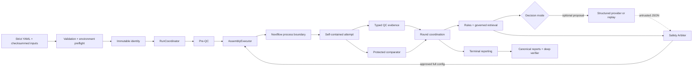

# 系统架构

HiFi Agent 将生产控制面、外部工具执行、科学决策和审计证据分离。唯一权威状态机控制生命周期，
Nextflow 只负责 attempt 内的工具调度，模型仅能产生不可信结构化 proposal。

## 高层数据流



## 核心组件

### 配置与 bootstrap

配置层解析全局和样本 YAML，拒绝未知字段与不安全路径，完整读取输入并生成 checksum、resolved config
和 validation receipt。环境层解析可执行文件、检查版本和主机资源。两者通过后才创建 immutable run
identity。

### `RunCoordinator`

唯一生产控制器，负责：

- lifecycle phase ordering；
- single-writer lock；
- write-ahead transaction 与 state/event 一致性；
- budget reservation；
- baseline、round 和 terminal 的调用顺序；
- 中断、工具失败和恢复分类。

`RunState` 是唯一权威 snapshot。event、budget ledger 和 manifest history 是可重算的审计记录，不是
第二套状态机。

### Assembly executor 与 Nextflow

baseline 和 candidate 共用 `AssemblyExecutor`、同一个 `ASSEMBLY_ATTEMPT` workflow entry 和相同
post-QC 合同。Python 边界负责批准配置、argv 渲染、工作目录和 manifest；Nextflow 负责受限的工具
进程、publish 和 cache。attempt 完成标记最后写入。

### 决策与比较

规则读取 typed QC feature。治理检索只返回允许用于当前参数的固定知识片段。在线模型和 replay 都没有
executor port；其 JSON 必须经过 Safety Arbiter。比较器使用固定多指标 policy、适用性条件和硬回退
阈值，决定接受候选、保留 incumbent、人工复核或停止。

### 报告与 verifier

报告服务只从 immutable manifests、状态和比较结果构建六个规范文件。verifier 独立读取磁盘证据，
重算 hash chain、inventory、参数合同、TSV/JSON 一致性和 provenance，不依赖控制器内存状态。

## 生命周期

```text
INITIALIZING
→ INPUT_VALIDATION
→ ENVIRONMENT_PREFLIGHT
→ PRE_QC
→ BASELINE_PLAN / BASELINE_ASSEMBLY / BASELINE_POST_QC / BASELINE_REVIEW
→ ROUND_CONTEXT / RAG_RETRIEVAL / LLM_PROPOSAL / SAFETY_REVIEW
→ BUDGET_RESERVATION / CANDIDATE_ASSEMBLY / CANDIDATE_POST_QC
→ ROUND_COMPARISON / INCUMBENT_UPDATE
→ REPORTING / VERIFYING
→ TERMINAL
```

不是每个 run 都经过 LLM 或 candidate phase。科学证据充分、无合法候选、预算不足或配置禁用优化时，
状态机按明确终态提前收敛。

## 目录所有权

| 目录 | 所有者 | 不变量 |
|---|---|---|
| `00_metadata` | bootstrap/config/environment | 配置、输入与环境 snapshot 不可变 |
| `01_pre_qc` | pre-QC executor | 原始指标和解析结果可追溯 |
| `02_assembly` | assembly executor | attempt 隔离，完成标记最后写 |
| `03_post_qc` | post-QC contract | 所有候选使用同一工具和参数合同 |
| `04_decisions` | rules/retrieval/arbiter/comparator | proposal、批准和比较链不可覆盖 |
| `05_agent` | coordinator | 唯一状态、event、transaction、budget 和 lock |
| `06_report` | reporting/verifier | 六个规范报告相互一致 |

## 证据链

```text
input bytes/checksum
→ config and environment snapshots
→ immutable identity
→ state/event/transaction/budget
→ decision context
→ rule/retrieval/provider receipt
→ safety decision and approved full config
→ rendered/realized argv contract
→ attempt inventory and completion marker
→ typed QC metrics
→ comparison and incumbent chain
→ terminal reports
→ deep verification
```

所有长期引用使用 run-relative path，并在需要时附带 SHA-256。报告和 provider prompt 不依赖个人绝对
路径。

## 信任边界

| 边界 | 信任级别 | 处理方式 |
|---|---|---|
| 用户 YAML 与输入文件 | 不可信输入 | Schema、路径、格式和完整 hash 验证 |
| 外部工具 stdout/文件 | 不可信工具输出 | typed parser、必需字段和文件合同 |
| 治理知识 snapshot | 受控输入 | manifest、来源和内容 hash |
| 模型 proposal | 不可信建议 | 严格 Schema 与 Safety Arbiter |
| approved full config | 可执行授权 | 单变量、风险、证据、预算和 argv 合同 |
| completion marker | attempt 终态证据 | 仅在 inventory 与合同完成后创建 |
| final summary | 权威报告 | 必须与 state、TSV 和 provenance 一致 |

## 恢复不变量

- 同一 run 只有一个 writer；
- 状态更新先写 pending transaction，再提交 snapshot/event；
- 预算 reservation ID 幂等；
- retry 不覆盖旧 attempt；
- completed attempt 必须先验证再复用；
- identity 漂移不能通过 `--resume` 绕过；
- report 可从终态幂等重建，但 verifier 不会覆盖被篡改证据。

## 打包边界

生产 Nextflow、比较 policy 和治理知识位于 Python package data 中，因此 wheel 不依赖源代码 checkout。
公开 `configs/comparison_policy.yaml` 必须与包内副本字节一致。portable fixture 只替换显式工具二进制，
仍经过真实控制器、解析器、比较器、报告和 verifier；它验证软件边界，不验证生物学。
