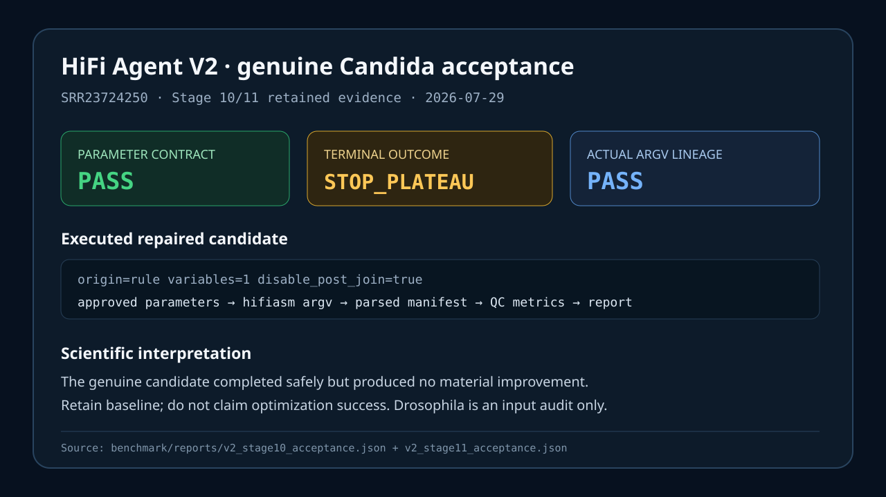

# V2 demos

## Ten-minute portable demo

```bash
hifi-agent demo-v2 /tmp/hifi-agent-v2-demo
sed -n '1,160p' /tmp/hifi-agent-v2-demo/v2_portable_demo.md
```

Expected output is `Scenarios passed: 5/5`. It loads the packaged V2 comparison policy and invokes
the production `RoundComparator` on deterministic metric fixtures covering safe improvement, hard
regression, plateau, missing core metrics, and Pareto conflict. Its JSON says
`biological_data_used: false`; it is an installation/safety demo, not biology.

## Genuine Candida report snapshot



The snapshot is generated from the retained Stage 10/11 acceptance values:

- genuine accession `SRR23724250`;
- completed repaired single-variable candidate;
- exact parameter contract `PASS`;
- actual argv lineage `PASS`;
- terminal `STOP_PLATEAU`;
- material improvement rate `0.0`;
- no biological improvement claim.

Machine-readable sources are
`benchmark/reports/v2_stage10_acceptance.json` and
`benchmark/reports/v2_stage11_acceptance.json`. The Drosophila accession is used only for full
FASTQ integrity/scale validation; no Drosophila assembly is shown.
